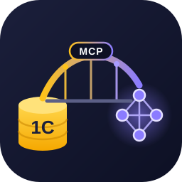
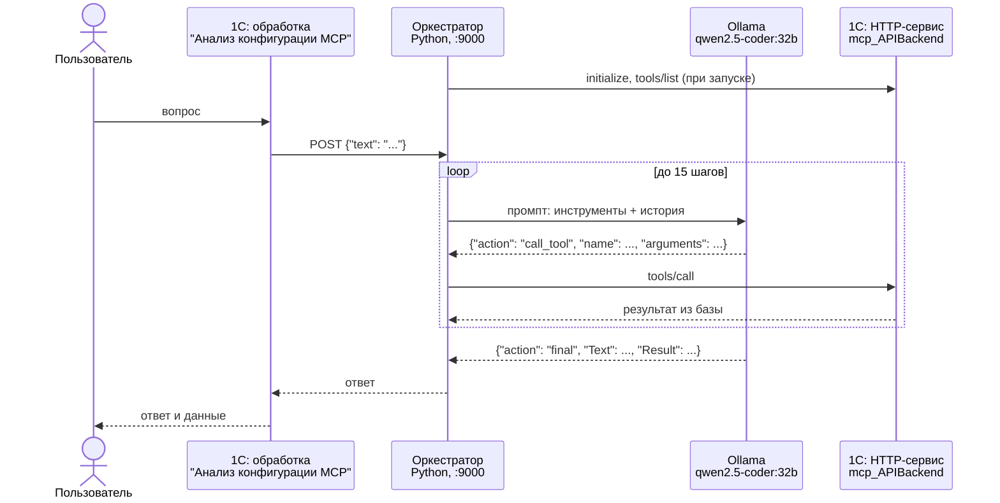

<div align="center">



# 1C MCP Ollama Bridge

### Задайте вопрос базе 1С обычным языком. Ответит нейросеть, которая работает на вашем компьютере.

Расширение конфигурации превращает информационную базу 1С:Предприятия в **MCP-сервер**,
а оркестратор подключает к нему **локальную языковую модель через Ollama**.
Модель сама выбирает инструменты, читает метаданные и данные базы и формулирует ответ.
Запросы и данные не покидают вашу сеть.

[](https://github.com/Kickfok/1c-mcp-ollama/actions/workflows/checks.yml)
[](https://github.com/Kickfok/1c-mcp-ollama/releases/latest)


[](LICENSE)

[**Быстрый старт**](#-быстрый-старт) ·
[Как это работает](#-как-это-работает) ·
[Инструменты](#-инструменты) ·
[Свой инструмент за 10 минут](#-свой-инструмент) ·
[Идеи развития](#-идеи-развития)

</div>

<br>

<p align="center">
  
  <br>
  <sub>Реальный прогон из журнала оркестратора: вопрос, вызов инструмента 1С, ответ модели. Видеокарта RTX 5070 12 ГБ.</sub>
</p>

---

## 💡 Зачем это

<table>
<tr>
<td width="33%" valign="top">

### 🔒 Данные остаются у вас
Модель `qwen2.5-coder:32b` работает в Ollama на вашем компьютере. Ни запрос, ни данные базы не
отправляются во внешние сервисы, поэтому решение можно использовать с базами, где есть
коммерческая тайна и персональные данные.

</td>
<td width="33%" valign="top">

### 🧩 Расширение, а не доработка
Все устроено как расширение `MCP_Сервер`: типовая конфигурация не меняется, заимствованных объектов
нет, БСП и БТС не требуются. Подключается к любой конфигурации на русском варианте встроенного языка
и снимается одним действием.

</td>
<td width="33%" valign="top">

### 🔌 Открытый протокол
HTTP-сервис реализует [Model Context Protocol](https://modelcontextprotocol.io) поверх JSON-RPC 2.0.
Кроме встроенного оркестратора к базе подключаются любые MCP-клиенты: Cursor, Claude Desktop и
другие.

</td>
</tr>
</table>

### Примеры вопросов

| Вопрос | Что делает модель |
|---|---|
| *Какая версия платформы и конфигурации?* | `get_configuration_version` |
| *Какие реквизиты и табличные части у документа "Реализация товаров"?* | `get_metadata_structure` |
| *Где используется справочник "Склады" и какие документы делают движения по регистру остатков?* | `list_object_dependencies` |
| *Какие есть отчеты по продажам и какие у них обязательные параметры?* | `get_report_list` |
| *Покажи чеки магазина "Центральный" за март* | `list_sale_param` (конфигурации на базе 1С:Розницы) |

<p align="center"><b>21</b> инструмент · <b>1</b> ресурс со справкой по встроенному языку · <b>0</b> зависимостей от БСП · <b>4096</b> токенов контекста · <b>12 ГБ</b> видеопамяти хватает</p>

## 🚀 Быстрый старт

**1. Расширение.** Скачайте `MCP_Server-<версия>.cfe` из [последнего релиза](https://github.com/Kickfok/1c-mcp-ollama/releases/latest)
и добавьте в "Администрирование - Расширения".

**2. Публикация.** Сервисы расширений не публикуются флажком "по умолчанию", перечислите сервис
в `default.vrd` явно:

```xml
<httpServices publishByDefault="true">
    <service name="mcp_APIBackend" rootUrl="mcp" enable="true"
             reuseSessions="autouse" sessionMaxAge="20" poolSize="10" poolTimeout="5"/>
</httpServices>
```

Проверка: `http://<сервер>/<публикация>/hs/mcp/health` отвечает `{"status": "ok"}`.

**3. Модель и оркестратор.**

```powershell
ollama pull qwen2.5-coder:32b
pip install -r orchestrator/requirements.txt
$env:MCP_URL = "http://localhost/mybase/hs/mcp"
python orchestrator/LLM_Orchestrator.py
```

**4. Вопрос.** Откройте в 1С обработку **"Анализ конфигурации MCP"** или отправьте запрос напрямую:

```powershell
Invoke-RestMethod -Uri http://127.0.0.1:9000/ -Method Post -ContentType "application/json; charset=utf-8" `
  -Body '{"text": "Какая версия платформы используется?"}'
```

Подробная инструкция с правами, безопасным режимом и проверками - [docs/INSTALL.md](docs/INSTALL.md).

## 🧠 Как это работает



**Расширение** знает, какие инструменты есть: каждая обработка из подсистемы
`mcp_КонтейнерыИнструментов` описывает свои инструменты и JSON-схемы параметров. **Оркестратор**
ведет диалог с моделью: передает ей описание инструментов, разбирает ответ, вызывает инструмент
в 1С, возвращает результат модели и повторяет до финального ответа. Ответы инструментов обрезаются
до 2500 символов, а модель отвечает строго в JSON, поэтому цикл укладывается в контекст 4096 токенов
и работает на видеокарте с 12 ГБ памяти.

<details>
<summary><b>Состав расширения</b></summary>

| Объект | Назначение |
|---|---|
| HTTP-сервис `mcp_APIBackend` (`/hs/mcp`) | Методы MCP: `initialize`, `tools/*`, `resources/*`, `prompts/*`; `/health` для проверки |
| Подсистемы `mcp_КонтейнерыИнструментов`, `...Ресурсов`, `...Промптов` | Реестр обработок-контейнеров: сервер находит инструменты по составу подсистем |
| Общие модули `mcp_*` | Протокол JSON-RPC, JSON, построение схем параметров, вызов контейнеров |
| Обработки `mcp_Инструмент*` | Контейнеры инструментов |
| Обработка `mcp_РесурсОписаниеСинтаксисаВстроенногоЯзыка` | Ресурс MCP: справка по синтаксису встроенного языка |
| Обработка `mcp_УправлениеСервером` | Просмотр зарегистрированных инструментов, ресурсов и промптов |
| Обработка `АнализКонфигурацииMCP` | Форма "вопрос - ответ"; макет `LLM_Orchestrator` содержит оркестратор и выгружается при автозапуске |
| Роль `mcp_ОсновнаяРоль` | Права на методы HTTP-сервиса и обработки расширения |

</details>

<details>
<summary><b>Настройки оркестратора</b></summary>

| Переменная окружения | По умолчанию | Назначение |
|---|---|---|
| `MCP_URL` | `https://localhost/yt_mcp_test/hs/mcp` | Адрес HTTP-сервиса `mcp_APIBackend` |
| `MCP_VERIFY_SSL` | `false` | Проверять TLS-сертификат публикации |
| `OLLAMA_URL` | `http://localhost:11434/api/generate` | API Ollama |
| `OLLAMA_MODEL` | `qwen2.5-coder:32b` | Модель |
| `ORCHESTRATOR_HOST` | `127.0.0.1` | Адрес, на котором оркестратор принимает запросы |
| `ORCHESTRATOR_PORT` | `9000` | Порт |

У оркестратора нет авторизации, поэтому по умолчанию он принимает запросы только с этого компьютера.
Не меняйте `ORCHESTRATOR_HOST` на `0.0.0.0` в сети, где к компьютеру есть доступ посторонних.

</details>

## 🧰 Инструменты

| Контейнер | Читают базу ✅ | Заглушки ⚠️ |
|---|---|---|
| **Данные о конфигурации** | `list_metadata_objects` · `get_metadata_structure` · `get_configuration_version` · `list_object_dependencies` · `get_report_list` | - |
| **Данные по продажам** | `list_sale_param` | `get_stock_balances` · `get_daily_revenue` · `get_top_products` · `analyze_receipts` · `get_low_stock_items` · `analyze_returns` · `analyze_discounts` · `calculate_stock_turnover` · `analyze_plan_execution` |
| **Для бухгалтерской работы** | - | `get_account_turnovers` · `analyze_accounts_receivable` · `calculate_vat_liability` · `calculate_product_margin` · `get_stock_turnover` · `get_cash_flow` |

> [!WARNING]
> **Заглушки возвращают фиксированные демонстрационные данные** и не читают базу, а модель перескажет
> их как настоящие. Это шаблоны интерфейса для будущих реализаций: используйте их как образец или
> исключите обработки из подсистемы `mcp_КонтейнерыИнструментов`. Параметры всех инструментов -
> в [docs/TOOLS.md](docs/TOOLS.md).

## 🛠 Свой инструмент

Новый инструмент - это обработка в расширении и два метода в модуле менеджера. Сервер найдет его
сам по составу подсистемы.

```bsl
Процедура ДобавитьИнструменты(Инструменты) Экспорт
	
	Параметры = Новый Массив;
	Параметры.Добавить(mcp_Метаданные.ПараметрИнструмента("name", "string", "Имя справочника", , Истина));
	
	mcp_Метаданные.ДобавитьИнструмент(Инструменты, "get_catalog_items", "Список элементов справочника",
		mcp_Метаданные.СхемаПараметровИнструмента(Параметры));
	
КонецПроцедуры

Функция ВыполнитьИнструмент(ИмяИнструмента, Аргументы) Экспорт
	
	Если ИмяИнструмента = "get_catalog_items" Тогда
		Возврат ЭлементыСправочника(Аргументы);
	КонецЕсли;
	
	ВызватьИсключение "Неизвестный инструмент: " + ИмяИнструмента;
	
КонецФункции
```

Ошибка в инструменте не роняет сервер: модель получает текст ошибки с `isError: true` и может
исправить аргументы. Правила и проверка - в [docs/DEVELOPMENT.md](docs/DEVELOPMENT.md).

<details>
<summary><b>Сборка, проверки и релиз</b></summary>

```powershell
# исходники -> база -> проверка модулей -> .cfe (нужна платформа 1С)
1cv8.exe DESIGNER /F"<база>" /LoadConfigFromFiles "src\extension" -Extension MCP_Сервер
1cv8.exe DESIGNER /F"<база>" /CheckModules -ThinClient -Server -ExternalConnection -Extension MCP_Сервер
1cv8.exe DESIGNER /F"<база>" /DumpCfg "build\MCP_Сервер.cfe" -Extension MCP_Сервер

# статические проверки, они же выполняются в GitHub Actions
python tools/check_sources.py

# проверка опубликованного сервера
python tests/mcp_smoke.py http://localhost/<публикация>/hs/mcp
```

`tools/check_sources.py` не пропустит обращение к модулям БСП и БТС, неизвестный код языка в
представлениях и расхождение макета `LLM_Orchestrator` с `orchestrator/LLM_Orchestrator.py`
(синхронизация: `python tools/sync_orchestrator.py`).

Релиз: соберите `build/MCP_Сервер.cfe`, поднимите версию в `src/extension/Configuration.xml`, добавьте
раздел в `CHANGELOG.md` и отправьте тег `vX.Y.Z`. Workflow `release.yml` сверит версии и опубликует
`MCP_Server-X.Y.Z.cfe` и архив оркестратора.

```
src/extension/      исходники расширения (выгрузка Конфигуратора, иерархический формат)
orchestrator/       LLM-оркестратор
build/              собранное расширение MCP_Сервер.cfe
tests/              проверка MCP-сервера по HTTP
tools/              проверки, синхронизация макета, генерация docs/TOOLS.md, описание релиза
docs/               установка, инструменты, разработка, изображения
```

</details>

## 🗺 Идеи развития

- [ ] Реальные запросы к данным вместо заглушек продаж и бухгалтерии
- [ ] Промпты MCP: готовые сценарии анализа конфигурации
- [ ] Инструменты для поиска по коду модулей и чтения текстов запросов
- [ ] Список инструментов на каждом шаге диалога для моделей с большим контекстом
- [ ] Запуск оркестратора как службы Windows

Есть идея или нашли ошибку - [откройте issue](https://github.com/Kickfok/1c-mcp-ollama/issues).
Pull request с новым инструментом - лучший способ развить проект.

## 🙏 Благодарности

Движок MCP-сервера основан на проекте [vladimir-kharin/1c_mcp](https://github.com/vladimir-kharin/1c_mcp)
Владимира Харина (MIT). В этом репозитории добавлены LLM-оркестратор для Ollama, форма анализа
конфигурации, инструменты зависимостей, отчетов, продаж и бухгалтерии, а движок доработан для работы
без БСП. Подробности - в [CHANGELOG](CHANGELOG.md).

## 📄 Лицензия

[MIT](LICENSE)

<div align="center">
<sub>1C MCP Ollama Bridge · сделано для разработчиков 1С, которым интересны локальные LLM</sub>
</div>
