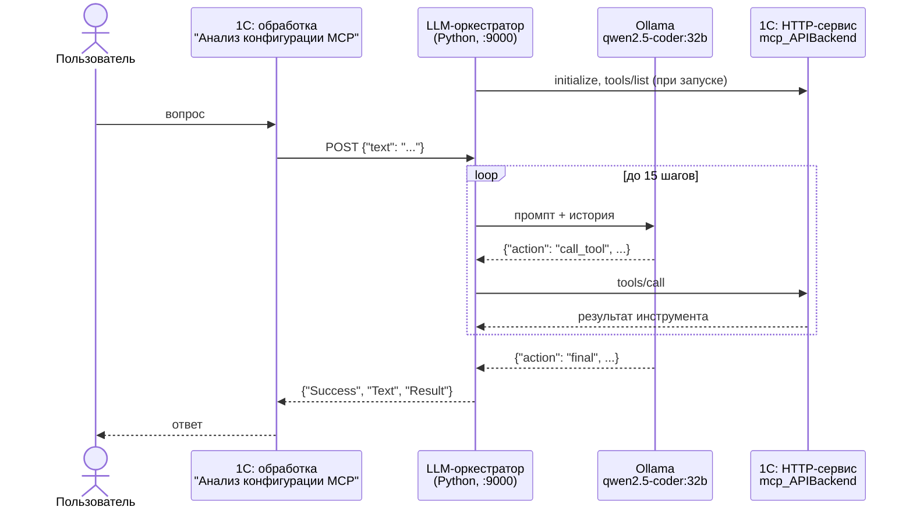

<div align="center">

# 1c-mcp-ollama

**MCP-сервер внутри 1С:Предприятия и оркестратор для локальной LLM через Ollama**

[](https://github.com/Kickfok/1c-mcp-ollama/actions/workflows/checks.yml)


[](LICENSE)

[Как это работает](#как-это-работает) •
[Инструменты](#инструменты) •
[Установка](#установка) •
[Оркестратор](#llm-оркестратор) •
[Разработка](#разработка)

</div>

---

Проект дает языковой модели доступ к информационной базе 1С по протоколу
[Model Context Protocol](https://modelcontextprotocol.io). Состоит из двух частей:

- **расширение конфигурации `MCP_Сервер`** - HTTP-сервис в 1С, который реализует MCP поверх JSON-RPC 2.0
  и отдает модели инструменты: структура метаданных, зависимости объектов, список отчетов, продажи и другие;
- **LLM-оркестратор** - Python-сервер, который принимает вопрос на естественном языке, в цикле
  передает его локальной модели в Ollama (по умолчанию `qwen2.5-coder:32b`), вызывает выбранные
  моделью инструменты 1С и возвращает итоговый ответ. Данные не покидают ваш компьютер.

Задать вопрос можно прямо из 1С: обработка **"Анализ конфигурации MCP"** при необходимости сама
запускает Ollama и оркестратор. К HTTP-сервису можно подключить и любой другой MCP-клиент
(Cursor, Claude Desktop и т. д.).

> [!NOTE]
> Движок MCP-сервера основан на проекте [vladimir-kharin/1c_mcp](https://github.com/vladimir-kharin/1c_mcp)
> (MIT). В этом репозитории добавлены LLM-оркестратор для Ollama, форма анализа конфигурации,
> инструменты зависимостей, отчетов, продаж и бухгалтерии; движок доработан (см. [CHANGELOG](CHANGELOG.md)).

## Как это работает



### Состав расширения

| Объект | Назначение |
|---|---|
| HTTP-сервис `mcp_APIBackend` (`/hs/mcp`) | Точка входа MCP: `initialize`, `tools/*`, `resources/*`, `prompts/*`; `/health` для проверки |
| Подсистемы `mcp_КонтейнерыИнструментов`, `...Ресурсов`, `...Промптов` | Реестр обработок-контейнеров: сервер находит инструменты по составу подсистем |
| Общие модули `mcp_*` | Протокол, JSON, описание схем параметров, вызов контейнеров |
| Обработки `mcp_Инструмент*` | Контейнеры инструментов |
| Обработка `mcp_РесурсОписаниеСинтаксисаВстроенногоЯзыка` | Ресурс: справка по синтаксису встроенного языка |
| Обработка `mcp_УправлениеСервером` | Просмотр зарегистрированных инструментов, ресурсов и промптов |
| Обработка `АнализКонфигурацииMCP` | Форма "вопрос - ответ" через оркестратор; макет `LLM_Orchestrator` содержит оркестратор |
| Роль `mcp_ОсновнаяРоль` | Права на HTTP-сервис и обработки расширения |

Заимствованных объектов нет, БСП и БТС не требуются: расширение подключается к любой конфигурации
на русском варианте встроенного языка.

## Инструменты

21 инструмент в трех контейнерах. Полное описание параметров - в [docs/TOOLS.md](docs/TOOLS.md).

> [!WARNING]
> **15 инструментов - заглушки.** Все инструменты контейнера "Для бухгалтерской работы" и 9 из 10
> инструментов "Данные по продажам" возвращают фиксированные демонстрационные данные и не читают базу.
> Модель перескажет эти цифры как настоящие. Используйте их только как образец для своих реализаций
> или исключите обработки из подсистемы `mcp_КонтейнерыИнструментов`.

| Контейнер | Работают с базой | Заглушки |
|---|---|---|
| Данные о конфигурации | `list_metadata_objects`, `get_metadata_structure`, `get_configuration_version`, `list_object_dependencies`, `get_report_list` | - |
| Данные по продажам | `list_sale_param` (нужны отчеты 1С:Розницы) | `get_stock_balances`, `get_daily_revenue`, `get_top_products`, `analyze_receipts`, `get_low_stock_items`, `analyze_returns`, `analyze_discounts`, `calculate_stock_turnover`, `analyze_plan_execution` |
| Для бухгалтерской работы | - | `get_account_turnovers`, `analyze_accounts_receivable`, `calculate_vat_liability`, `calculate_product_margin`, `get_stock_turnover`, `get_cash_flow` |

Ресурс `file://resource/syntax_1c.txt` - справка по синтаксису встроенного языка 1С.

## Установка

Кратко; подробная инструкция с проверками - в [docs/INSTALL.md](docs/INSTALL.md).

1. **Подключите расширение.** Скачайте `MCP_Сервер.cfe` со страницы
   [релизов](https://github.com/Kickfok/1c-mcp-ollama/releases) (или из каталога [build](build)) и добавьте
   в "Администрирование - Расширения". MCP-серверу безопасный режим не мешает; снимать его нужно,
   только если форма "Анализ конфигурации MCP" должна сама запускать Ollama и оркестратор
   или `get_report_list` должен читать параметры внешних отчетов.
2. **Опубликуйте HTTP-сервис.** Сервисы расширений не публикуются флажком "Публиковать по умолчанию",
   их нужно перечислить в `default.vrd` явно:
   ```xml
   <httpServices publishByDefault="true">
       <service name="mcp_APIBackend" rootUrl="mcp" enable="true"
                reuseSessions="autouse" sessionMaxAge="20" poolSize="10" poolTimeout="5"/>
   </httpServices>
   ```
   Проверка: `http://<сервер>/<публикация>/hs/mcp/health` отвечает `{"status": "ok"}`.
3. **Запустите оркестратор** (раздел ниже) или подключите свой MCP-клиент к `.../hs/mcp`.

## LLM-оркестратор

Требования: Python 3.10+, [Ollama](https://ollama.com) с моделью `qwen2.5-coder:32b`
(или другой, см. `OLLAMA_MODEL`).

```powershell
ollama pull qwen2.5-coder:32b
pip install -r orchestrator/requirements.txt
$env:MCP_URL = "http://localhost/mybase/hs/mcp"
python orchestrator/LLM_Orchestrator.py
```

Запрос и ответ:

```powershell
$body = '{"text": "Какая версия платформы используется?"}'
Invoke-RestMethod -Uri http://127.0.0.1:9000/ -Method Post -Body $body -ContentType "application/json; charset=utf-8"
```

```json
{ "Success": true, "Text": "краткий ответ модели", "Result": { "...": "данные инструментов" } }
```

| Переменная окружения | По умолчанию | Назначение |
|---|---|---|
| `MCP_URL` | `https://localhost/yt_mcp_test/hs/mcp` | Адрес HTTP-сервиса `mcp_APIBackend` |
| `MCP_VERIFY_SSL` | `false` | Проверять TLS-сертификат публикации |
| `OLLAMA_URL` | `http://localhost:11434/api/generate` | API Ollama |
| `OLLAMA_MODEL` | `qwen2.5-coder:32b` | Модель |
| `ORCHESTRATOR_HOST` | `127.0.0.1` | Адрес, на котором оркестратор принимает запросы |
| `ORCHESTRATOR_PORT` | `9000` | Порт |

Параметры контекста модели (`OLLAMA_NUM_CTX = 4096`, обрезка ответов инструментов до 2500 символов)
подобраны под видеокарту с 12 ГБ памяти и описаны в начале `LLM_Orchestrator.py`.

> [!CAUTION]
> У оркестратора нет авторизации. Не меняйте `ORCHESTRATOR_HOST` на `0.0.0.0` в сети, где к
> компьютеру есть доступ посторонних: любой сможет задавать вопросы к вашей базе.

## Разработка

### Структура репозитория

```
src/extension/      исходники расширения MCP_Сервер (выгрузка Конфигуратора, иерархический формат)
orchestrator/       LLM-оркестратор
build/              собранное расширение MCP_Сервер.cfe
tests/mcp_smoke.py  проверка работающего MCP-сервера по HTTP
tools/              проверки исходников, синхронизация макета, генерация docs/TOOLS.md
docs/               установка, инструменты, разработка
```

### Сборка и проверка

```powershell
# загрузить исходники в базу и собрать .cfe (нужна платформа 1С)
1cv8.exe DESIGNER /F"<база>" /LoadConfigFromFiles "src\extension" -Extension MCP_Сервер
1cv8.exe DESIGNER /F"<база>" /CheckModules -ThinClient -Server -ExternalConnection -Extension MCP_Сервер
1cv8.exe DESIGNER /F"<база>" /DumpCfg "build\MCP_Сервер.cfe" -Extension MCP_Сервер

# статические проверки (выполняются и в GitHub Actions)
python tools/check_sources.py

# проверка опубликованного сервера
python tests/mcp_smoke.py http://localhost/<публикация>/hs/mcp
```

После правки `orchestrator/LLM_Orchestrator.py` обновите макет в расширении:
`python tools/sync_orchestrator.py`. Проверка в CI не пропустит расхождение.

Релиз: соберите `build/MCP_Сервер.cfe`, поднимите версию в `src/extension/Configuration.xml`, добавьте
раздел в `CHANGELOG.md` и отправьте тег `vX.Y.Z`. Workflow `release.yml` проверит совпадение версий и
опубликует релиз с `MCP_Сервер.cfe` и архивом оркестратора.

### Новый инструмент

Создайте в расширении обработку, включите ее в подсистему `mcp_КонтейнерыИнструментов` и реализуйте
в модуле менеджера `ДобавитьИнструменты(Инструменты)` и `ВыполнитьИнструмент(ИмяИнструмента, Аргументы)`.
Пример и правила - в [docs/DEVELOPMENT.md](docs/DEVELOPMENT.md).

## Лицензия

[MIT](LICENSE). Движок MCP-сервера - (c) 2025 Владимир Харин,
[vladimir-kharin/1c_mcp](https://github.com/vladimir-kharin/1c_mcp).
