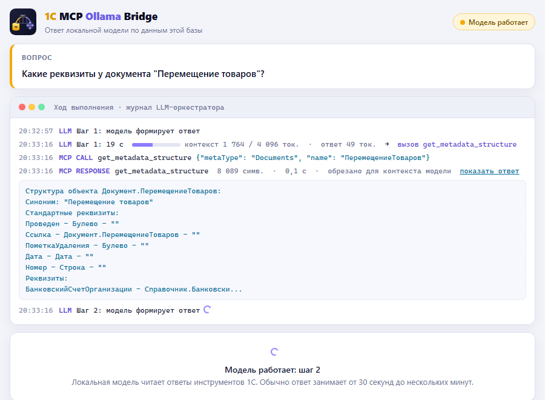
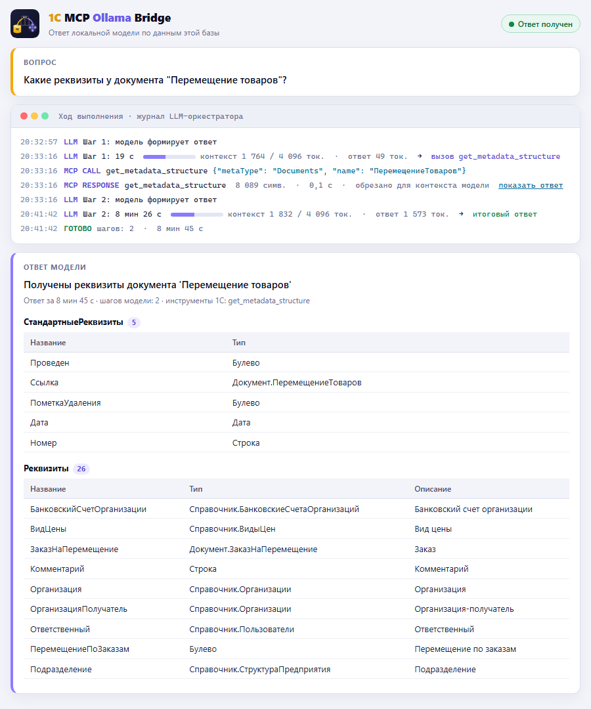
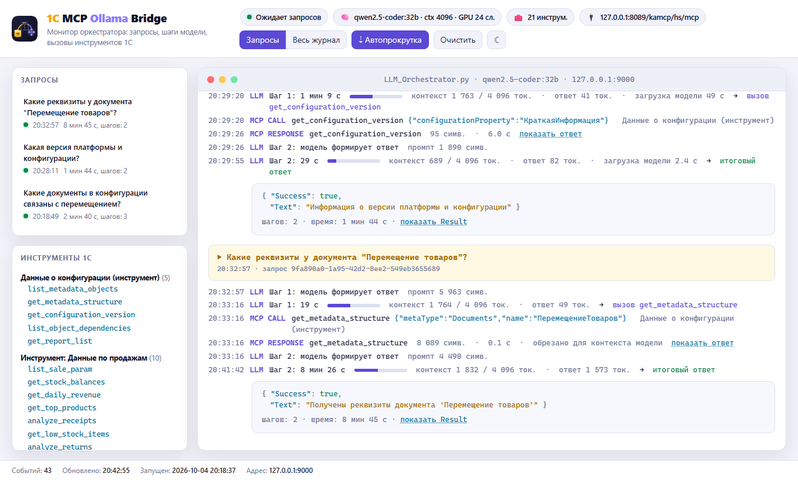
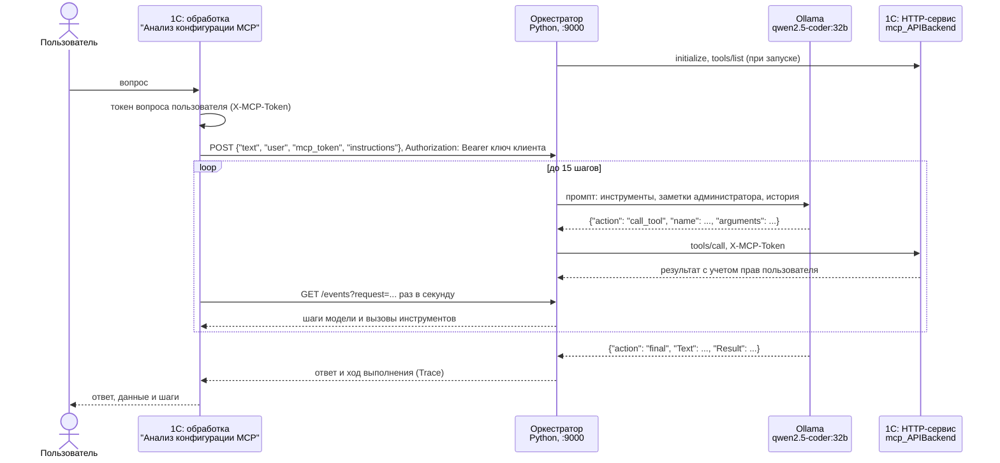

<div align="center">


# 1C MCP Ollama Bridge

### Задайте вопрос базе 1С обычным языком. Ответит нейросеть, которая работает на вашем компьютере.

Расширение конфигурации превращает информационную базу 1С:Предприятия в **MCP-сервер**,
а оркестратор подключает к нему **локальную языковую модель через Ollama**.
Модель сама выбирает инструменты, читает метаданные и данные базы и формулирует ответ.
Запросы и данные не покидают вашу сеть.

[](https://github.com/Kickfok/1c-mcp-ollama/actions/workflows/checks.yml)
[](https://github.com/Kickfok/1c-mcp-ollama/releases/latest)


[](https://petstore.swagger.io/?url=https://raw.githubusercontent.com/Kickfok/1c-mcp-ollama/main/docs/api/openapi.json)
[](LICENSE)

[**Быстрый старт**](#быстрый-старт) ·
[Инструкция пользователя](docs/USER_GUIDE.md) ·
[Инструкция администратора](docs/ADMIN_GUIDE.md) ·
[Форма и монитор](#форма-1с-и-монитор) ·
[Реальные прогоны](#реальные-прогоны) ·
[Как это работает](#как-это-работает) ·
[Инструменты](#инструменты) ·
[API (Swagger)](#-api-swagger) ·
[Свой инструмент](#свой-инструмент) ·
[Идеи развития](#идеи-развития)

</div>

<br>

<p align="center">
  
  <br>
  <sub>Реальный прогон из журнала оркестратора: вопрос, вызов инструмента 1С, ответ модели. Видеокарта RTX 5070 12 ГБ.</sub>
</p>

---

## Зачем это

<table>
<tr>
<td width="33%" valign="top">

### Данные остаются у вас
Модель `qwen2.5-coder:32b` работает в Ollama на вашем компьютере. Ни запрос, ни данные базы не
отправляются во внешние сервисы, поэтому решение можно использовать с базами, где есть
коммерческая тайна и персональные данные.

</td>
<td width="33%" valign="top">

### Отдельное расширение
Сервер поставляется расширением `MCP_Сервер` без заимствованных объектов, типовая конфигурация не
меняется. Ключи хранятся в безопасном хранилище БСП, права выдаются профилями групп доступа.
Расширение отключается в списке расширений.

</td>
<td width="33%" valign="top">

### Открытый протокол
HTTP-сервис реализует [Model Context Protocol](https://modelcontextprotocol.io) поверх JSON-RPC 2.0.
Кроме встроенного оркестратора к базе подключаются любые MCP-клиенты: Cursor, Claude Desktop и
другие.

</td>
</tr>
</table>

### Примеры вопросов

| Вопрос | Что делает модель |
|---|---|
| *Какая версия платформы и конфигурации?* | `get_configuration_version` |
| *Какие реквизиты и табличные части у документа "Реализация товаров"?* | `get_metadata_structure` |
| *Где используется справочник "Склады" и какие документы делают движения по регистру остатков?* | `list_object_dependencies` |
| *Какие есть отчеты по продажам и какие у них обязательные параметры?* | `get_report_list` |
| *Покажи чеки магазина "Центральный" за март* | `list_sale_param` (конфигурации на базе 1С:Розницы) |
| *Перечисли контрагентов в базе* | пишет запрос на языке 1С и выполняет его: `run_query` |
| *Сколько документов реализации проведено в марте?* | `get_metadata_structure`, `find_report_queries`, `validate_query`, `run_query` |

Когда готового инструмента нет, модель сама составляет запрос 1С. Перед выполнением сервер проверяет
право чтения пользователя на каждую таблицу запроса.

<p align="center"><b>24</b> инструмента · <b>1</b> ресурс со справкой по встроенному языку · <b>0</b> заимствованных объектов · <b>4096</b> токенов контекста · <b>12 ГБ</b> видеопамяти хватает</p>

## Реальные прогоны

Шесть вопросов, по одному на каждый основной инструмент конфигурации, заданы копии рабочей базы
**1С:Комплексная автоматизация 2 (2.5.25.109)**. Модель `qwen2.5-coder:32b`, контекст 4096 токенов,
RTX 5070 12 ГБ: на видеокарте 24 слоя модели, остальные на процессоре. Ниже фрагменты журнала
оркестратора без правок; длинные ответы инструментов сокращены, сокращение отмечено `...`.

| Вопрос | Инструмент 1С | Шагов | Время | Что получилось |
|---|---|:-:|--:|---|
| Какая конфигурация установлена и какой у нее номер версии? | `get_configuration_version` | 2 | 2 мин 21 с | Название конфигурации, номер версии модель не запросила |
| Какие документы связаны с перемещением? | `list_metadata_objects` | 3 | 57 с | Исправила свой вызов после ошибки; список неполный |
| Какие реквизиты у документа "Перемещение товаров"? | `get_metadata_structure` | 2 | 8 мин 41 с | 5 стандартных и 26 реквизитов с типами |
| Какие документы делают движения по регистру ТоварыНаСкладах? | `list_object_dependencies` | 2 | 6 мин 21 с | Сводка: 58 документов-регистраторов, 16 в ответе |
| Есть ли отчет по валовой прибыли и какие у него параметры? | `get_report_list` | 2 | 36 с | Поиск по словам "валовая прибыль" ничего не нашел, модель так и ответила |
| Перечисли контрагентов в базе | `run_query` | 2 | 47 с | Модель написала запрос сама, в ответе таблица из 2 строк |

Время первого прогона включает загрузку модели в память. Долгие ответы в третьем и четвертом
прогонах - это генерация большого JSON: модель переписывает в `Result` десятки строк, а 60% модели
при 24 слоях на видеокарте считается процессором (`ollama ps`: `60%/40% CPU/GPU`).

<details>
<summary><b>1. Версия конфигурации:</b> <code>get_configuration_version</code></summary>

```text
19:34:05 Новый запрос: Какая конфигурация установлена в базе и какой у нее номер версии?
19:35:58 Вызов инструмента: get_configuration_version с аргументами: {'configurationProperty': 'КраткаяИнформация'}
19:35:58 MCP RESPONSE: {"ИмяСвойства": "КраткаяИнформация", "ЗначениеСвойства": "1С:Комплексная автоматизация 2"}
19:36:26 Запрос завершен за 2 шагов
19:36:26 Запрос обработан за 141.16 секунд
```

```json
{ "Success": true, "Text": "Установлена конфигурация 1С:Комплексная автоматизация версии 2" }
```

Модель выбрала свойство `КраткаяИнформация`, в котором нет номера версии. Номер возвращает свойство
`ВерсияКонфигурации`; список допустимых значений инструмент сообщает в тексте ошибки, если модель
передаст несуществующее свойство.

</details>

<details>
<summary><b>2. Документы о перемещении:</b> <code>list_metadata_objects</code>, модель исправляет свой вызов</summary>

```text
19:36:26 Новый запрос: Какие документы в конфигурации связаны с перемещением?
19:36:43 Вызов инструмента: list_metadata_objects с аргументами: {}
19:36:43 MCP RESPONSE: Ошибка выполнения инструмента 'list_metadata_objects': Не задан обязательный параметр metaType (например: Documents, Catalogs).
19:36:55 Вызов инструмента: list_metadata_objects с аргументами: {'metaType': 'Documents'}
19:36:55 MCP RESPONSE: Документ.АвансовыйОтчет (Авансовый отчет)
                       Документ.АвансовыйПлатежИностранцаПоНДФЛ (Авансовый платеж по НДФЛ) ...
19:37:23 Запрос завершен за 3 шагов
19:37:23 Запрос обработан за 57.16 секунд
```

```json
{
  "Success": true,
  "Text": "Частичный список документов в конфигурации, связанных с перемещением.",
  "Result": ["Документ.АктОРасхожденияхПослеПеремещения (Акт о расхождениях после перемещения)"]
}
```

Ошибка инструмента не прервала диалог: модель прочитала текст ошибки и повторила вызов с нужным
параметром. Список документов КА не помещается в 2500 символов, которые оркестратор передает
модели, поэтому `ПеремещениеТоваров` в ответ не попал, и модель сама назвала список частичным.

</details>

<details>
<summary><b>3. Реквизиты документа:</b> <code>get_metadata_structure</code></summary>

```text
19:37:23 Новый запрос: Какие реквизиты у документа "Перемещение товаров"?
19:37:42 Вызов инструмента: get_metadata_structure с аргументами: {'metaType': 'Documents', 'name': 'ПеремещениеТоваров'}
19:37:44 MCP RESPONSE: Структура объекта Документ.ПеремещениеТоваров:
                       Синоним: "Перемещение товаров"
                       Стандартные реквизиты:
                           Проведен - Булево - "" ...
19:46:04 Запрос завершен за 2 шагов
19:46:04 Запрос обработан за 521.01 секунд
```

```json
{
  "Success": true,
  "Text": "Получены реквизиты документа 'Перемещение товаров'",
  "Result": {
    "СтандартныеРеквизиты": [ { "Название": "Проведен", "Тип": "Булево" }, ... ],
    "Реквизиты": [
      { "Название": "СкладОтправитель", "Тип": "Справочник.Склады", "Описание": "Склад-отправитель" },
      { "Название": "СкладПолучатель", "Тип": "Справочник.Склады", "Описание": "Склад-получатель" },
      { "Название": "Статус", "Тип": "Перечисление.СтатусыПеремещенийТоваров", "Описание": "Отгружено, Принято" },
      ...
    ]
  }
}
```

Модель сама перевела русское название "Перемещение товаров" в имя объекта `ПеремещениеТоваров`.

</details>

<details>
<summary><b>4. Регистраторы регистра:</b> <code>list_object_dependencies</code></summary>

```text
19:46:04 Новый запрос: Какие документы делают движения по регистру накопления ТоварыНаСкладах?
19:46:30 Вызов инструмента: list_object_dependencies с аргументами: {'objectName': 'ТоварыНаСкладах', 'objectType': 'AccumulationRegisters', 'maxItems': 100, 'scopeTypes': 'Documents'}
19:46:36 MCP RESPONSE: {"objectName": "ТоварыНаСкладах", "objectType": "AccumulationRegisters",
                        "fullName": "РегистрНакопления.ТоварыНаСкладах", "usesTotal": ...
19:52:26 Запрос завершен за 2 шагов
19:52:26 Запрос обработан за 381.32 секунд
```

```json
{
  "Success": true,
  "Text": "Часть документов, делающих движения по регистру накопления ТоварыНаСкладах.",
  "Result": { "fullName": "РегистрНакопления.ТоварыНаСкладах", "usedByTotal": 58, "usesTotal": 6, "usedBy": [ ... 16 документов ... ] }
}
```

Модель сама заполнила четыре параметра: имя и тип объекта, ограничение по документам и лимит.
Инструмент нашел 58 документов-регистраторов; в ответ попали 16, которые поместились в 2500 символов
ответа инструмента, и модель об этом предупредила.

</details>

<details>
<summary><b>5. Отчет по валовой прибыли:</b> <code>get_report_list</code></summary>

```text
19:52:26 Новый запрос: Есть ли в конфигурации отчет по валовой прибыли и какие у него параметры?
19:52:48 Вызов инструмента: get_report_list с аргументами: {'reportName': 'валовая прибыль', 'includeDescription': True, 'source': 'All', 'includeParameters': True}
19:52:49 MCP RESPONSE: СПИСОК ОТЧЕТОВ ==================== Всего отчетов: 0
19:53:02 Запрос завершен за 2 шагов
19:53:02 Запрос обработан за 36.37 секунд
```

```json
{ "Success": true, "Text": "Отчет по валовой прибыли не найден в конфигурации.", "Result": {} }
```

Инструмент ищет подстроку в имени и синониме отчета. Отчета со словами "валовая прибыль" в
синониме в КА нет, и модель не стала выдумывать. Валовую прибыль в КА считает отчет
`ВаловаяПрибыльПоОплаченнымОтгрузкам` с синонимом "Прибыль по оплате отгрузок": прямой вызов
`get_report_list` с `reportName: "прибыль"` находит его вторым в списке.

</details>

<details>
<summary><b>6. Произвольный вопрос:</b> <code>run_query</code>, модель пишет запрос сама</summary>

```text
19:35:20 Новый запрос: Перечисли контрагентов в базе
19:35:39 Вызов инструмента: run_query с аргументами: {'query': 'ВЫБРАТЬ Контрагенты.Наименование КАК Наименование ИЗ Справочник.Контрагенты КАК Контрагенты'}
19:35:39 MCP RESPONSE: {"columns": ["Наименование"], "rows": [["Наше предприятие"], ["Розничный покупатель"]], "rowCount": 2, ...
19:36:07 Запрос завершен за 2 шагов
19:36:07 Запрос обработан за 47.25 секунд
```

```json
{
  "Success": true,
  "Text": "Список контрагентов в базе",
  "Result": { "columns": ["Наименование"], "rows": [["Наше предприятие"], ["Розничный покупатель"]], ... }
}
```

Инструмента "список контрагентов" в расширении нет. Модель составила запрос на языке 1С, сервер
проверил право чтения `Справочник.Контрагенты` у пользователя, задавшего вопрос, и выполнил запрос
с `РАЗРЕШЕННЫЕ`. Форма выводит результат таблицей. Тот же вопрос от пользователя без права на
справочник вернул ошибку прав, и модель ответила, что данных получить не удалось.

На вопрос "Выведи список пользователей базы" модель сначала читает структуру справочника
`Пользователи`. Без подсказки она переписывала эту структуру в ответ вместо запроса к данным, и
генерация занимала 8 минут. Теперь оркестратор добавляет к ответу `get_metadata_structure` и
`list_metadata_objects` подсказку, что это описание конфигурации, а не записи. Модель вызывает
`run_query`, исправляет свою синтаксическую ошибку в запросе (`КУДА` вместо `ГДЕ`) и отвечает списком
из 6 пользователей за 2 мин 10 с. Вопрос "Какие реквизиты у справочника Валюты?" по-прежнему
отвечается структурой справочника, без запроса.

</details>

## Быстрый старт

### 1. Расширение

Скачайте `MCP_Server-<версия>.cfe` из [последнего релиза](https://github.com/Kickfok/1c-mcp-ollama/releases/latest)
и добавьте в "Администрирование - Расширения", снимите флажок "Безопасный режим". Нужна конфигурация
на БСП 3.1+. Пользователям, которые задают вопросы, выдайте роль "Вопросы к LLM по данным базы (MCP)"
через профиль групп доступа.

### 2. Публикация

Сервисы расширений не публикуются флажком "по умолчанию", перечислите сервис
в `default.vrd` явно:

```xml
<httpServices publishByDefault="true">
    <service name="mcp_APIBackend" rootUrl="mcp" enable="true"
             reuseSessions="autouse" sessionMaxAge="20" poolSize="10" poolTimeout="5"/>
</httpServices>
```

Публикация входит под техническим пользователем с ролью `mcp_ОсновнаяРоль`, не под администратором.
Проверка: `http://<сервер>/<публикация>/hs/mcp/health` отвечает `{"status": "ok"}`.

### 3. Модель и оркестратор

```powershell
ollama pull qwen2.5-coder:32b
pip install -r orchestrator/requirements.txt
$env:MCP_URL = "http://localhost/mybase/hs/mcp"
python orchestrator/LLM_Orchestrator.py --config orchestrator/LLM_Orchestrator.config.json
```

При первом запуске оркестратор создает ключ клиента и ключ администратора и записывает их в файл
конфигурации.

### 4. Настройки в 1С

Обработка "Анализ конфигурации MCP", кнопка "Настройки": адрес оркестратора и `client_key` из файла
конфигурации, затем "Записать и проверить". Диагностика выполняет 10 проверок и называет ту, что не
прошла. На вкладке "Заметки для модели" можно описать особенности базы: основную организацию, склады,
регистры выручки и остатков. Так настраивается серверный режим: оркестратор работает на сервере, вопросы отправляет
сервер 1С. В локальном режиме Ollama и оркестратор работают на компьютере пользователя, форма тонкого
клиента запускает их сама после вопроса пользователю - см. [режимы работы](docs/INSTALL.md#7-режимы-работы-и-форма-вопроса).

### 5. Вопрос

Задайте вопрос в форме обработки или напрямую:

```powershell
Invoke-RestMethod -Uri http://127.0.0.1:9000/ -Method Post -ContentType "application/json; charset=utf-8" `
  -Headers @{ Authorization = "Bearer <client_key>" } -Body '{"text": "Какая версия платформы используется?"}'
```

Подробная инструкция с правами, безопасным режимом и проверками - [docs/INSTALL.md](docs/INSTALL.md).

| Документ | Для кого |
|---|---|
| [Инструкция пользователя](docs/USER_GUIDE.md) | Как задать вопрос, ход выполнения, остановка, права, локальный режим, со снимками экрана |
| [Инструкция администратора](docs/ADMIN_GUIDE.md) | Установка, права, публикация, оркестратор, настройки, диагностика, токены, неполадки, со снимками экрана |
| [INSTALL.md](docs/INSTALL.md) | Технический справочник: файлы конфигурации, переменные окружения, API оркестратора |

## Форма 1С и монитор

Пользователь 1С работает с обработкой "Анализ конфигурации MCP". Форма отправляет вопрос
оркестратору (`POST /requests`) и раз в секунду читает его состояние и журнал: пока модель думает,
справа видно, на каком она шаге, какой инструмент 1С вызвала, с какими аргументами и сколько контекста
заняла. Ответ выводится карточкой, данные из `Result` - таблицами и списками, результат `run_query` -
таблицей с колонками запроса и числом строк.

<table>
<tr>
<td width="50%" align="center"><b>Модель работает</b></td>
<td width="50%" align="center"><b>Ответ</b></td>
</tr>
<tr>
<td></td>
<td></td>
</tr>
</table>

- светлое оформление в цветах проекта, HTML выводится в поле формы и работает в тонком и веб-клиенте;
- переключатель "Показывать ход выполнения" скрывает журнал шагов и оставляет вопрос и ответ;
- примеры вопросов на стартовом экране: нажатие на пример сразу отправляет его;
- кнопка "Остановить" прерывает запрос после текущего шага модели;
- строка над ответом показывает режим: серверный (оркестратор на сервере) или локальный (на этом
  компьютере, с автозапуском Ollama и оркестратора из тонкого клиента);
- если подключение не настроено, форма объясняет причину: администратору открывает "Настройки",
  пользователю предлагает обратиться к администратору;
- кнопка "Монитор оркестратора" открывает монитор в браузере.

Монитор оркестратора (`http://127.0.0.1:9000/monitor`) показывает тот же журнал, что выводится в консоль,
только по всем запросам и в оформлении проекта: история запросов, инструменты 1С по контейнерам,
каждый шаг модели с заполнением контекста, вызовы инструментов с аргументами и ответами, итоговый
JSON. Тема переключается кнопкой, `python LLM_Orchestrator.py --monitor` открывает монитор отдельным
окном.

<p align="center">
  
</p>

<details>
<summary><b>Светлая тема монитора</b></summary>
<p align="center"></p>
</details>

## Как это работает



Список инструментов расширение собирает по составу подсистемы `mcp_КонтейнерыИнструментов`: каждая
обработка в ней описывает свои инструменты и JSON-схемы параметров. Оркестратор ведет диалог с
моделью: передает ей описание инструментов, разбирает ответ, вызывает инструмент в 1С, возвращает
результат модели и повторяет до финального ответа. Ответы инструментов обрезаются до 2500 символов,
а модель отвечает строго в JSON, поэтому цикл укладывается в контекст 4096 токенов и работает на
видеокарте с 12 ГБ памяти.

Заметки администратора (вкладка "Заметки для модели" в настройках, до 1500 символов) уходят
оркестратору с каждым вопросом и попадают в промпт на каждом шаге. Внешние MCP-клиенты получают их
в поле `instructions` ответа `initialize`.

<details>
<summary><b>Состав расширения</b></summary>

| Объект | Назначение |
|---|---|
| HTTP-сервис `mcp_APIBackend` (`/hs/mcp`) | Методы MCP: `initialize`, `tools/*`, `resources/*`, `prompts/*`; `/health` для проверки |
| Подсистемы `mcp_КонтейнерыИнструментов`, `...Ресурсов`, `...Промптов` | Реестр обработок-контейнеров: сервер находит инструменты по составу подсистем |
| Общие модули `mcp_*` | Протокол JSON-RPC, JSON, построение схем параметров, вызов контейнеров |
| Общий модуль `mcp_ОркестраторLLM` | Вопрос оркестратору с ключом и токеном пользователя, чтение хода выполнения |
| Общие модули `mcp_НастройкиLLM`, `mcp_ДоступПользователей`, `mcp_ДиагностикаLLM` | Настройки, заметки для модели и ключи в безопасном хранилище БСП, токены и проверка прав, диагностика подключения |
| Общий модуль `mcp_КонтейнерыПовтИсп` | Кеш на сеанс: инструменты, ресурсы и промпты контейнеров, тексты запросов из схем компоновки отчетов |
| Регистры `mcp_НастройкиLLM`, `mcp_ТокеныДоступа` | Настройки базы и личные настройки; хеши токенов (сами токены не хранятся) |
| Общий модуль `mcp_APIBackendОписание` | Описание HTTP-сервиса для swagger-1c |
| Обработки `mcp_Инструмент*` | Контейнеры инструментов |
| Обработка `mcp_РесурсОписаниеСинтаксисаВстроенногоЯзыка` | Ресурс MCP: справка по синтаксису встроенного языка |
| Обработка `mcp_УправлениеСервером` | Просмотр зарегистрированных инструментов, ресурсов и промптов |
| Обработка `АнализКонфигурацииMCP` | Форма "вопрос - ответ" с ответом в HTML, формы "Настройки" и "Мои настройки"; макет `ОформлениеОтвета` - шаблон страницы, макет `LLM_Orchestrator` содержит оркестратор и выгружается при автозапуске |
| Роль `mcp_ОсновнаяРоль` | Права на методы HTTP-сервиса и обработки расширения (пользователь публикации) |
| Роль `mcp_ИспользованиеLLM` | Вопросы к LLM: обработка "Анализ конфигурации MCP" и токен вопроса |

</details>

<details>
<summary><b>Настройки и API оркестратора</b></summary>

Настройки - в файле `--config` (JSON) или переменных окружения: `mcp_url` (`MCP_URL`), `ollama_model`,
`ollama_num_gpu` (для 32B на 12 ГБ - `24`), `host`/`port` (по умолчанию `127.0.0.1:9000`), ключи
`client_key` и `admin_key` (создаются при первом запуске), `tls_cert`/`tls_key` для HTTPS.

Ключ передается заголовком `Authorization: Bearer`. Ключ клиента задает вопросы и читает журнал только
своего вопроса; ключ администратора открывает монитор и общий журнал. Без ключа доступны только
`GET /health` и страница монитора. Основные адреса: `POST /requests` (вопрос, сразу возвращает
идентификатор), `GET /requests/{id}`, `GET /events?request={id}`, `POST /` (синхронный вопрос),
`POST /diagnostics`. Полностью - [docs/INSTALL.md](docs/INSTALL.md#5-оркестратор).

</details>

## Инструменты

| Контейнер | Читают базу ✅ | Заглушки ⚠️ |
|---|---|---|
| **Данные о конфигурации** | `list_metadata_objects` · `get_metadata_structure` · `get_configuration_version` · `list_object_dependencies` · `get_report_list` · `find_report_queries` · `validate_query` · `run_query` | - |
| **Данные по продажам** | `list_sale_param` | `get_stock_balances` · `get_daily_revenue` · `get_top_products` · `analyze_receipts` · `get_low_stock_items` · `analyze_returns` · `analyze_discounts` · `calculate_stock_turnover` · `analyze_plan_execution` |
| **Для бухгалтерской работы** | - | `get_account_turnovers` · `analyze_accounts_receivable` · `calculate_vat_liability` · `calculate_product_margin` · `get_stock_turnover` · `get_cash_flow` |

> [!WARNING]
> **Заглушки возвращают фиксированные демонстрационные данные** и не читают базу, а модель перескажет
> их как настоящие. Это шаблоны интерфейса для будущих реализаций: используйте их как образец или
> исключите обработки из подсистемы `mcp_КонтейнерыИнструментов`. Параметры всех инструментов -
> в [docs/TOOLS.md](docs/TOOLS.md).

Инструменты запросов:

- `find_report_queries` находит в схемах компоновки отчетов запросы по словам вопроса, модель берет
  их как образец имен таблиц и полей;
- `validate_query` разбирает текст запроса и проверяет права, данные не читает;
- `run_query` выполняет запрос с `РАЗРЕШЕННЫЕ` и возвращает не больше `maxRows` строк (по умолчанию 20,
  до 500). Право чтения проверяется по каждой таблице, по таблицам вложенных запросов и по объектам
  полей, прочитанных через точку. Ограничения на уровне записей (RLS) пользователя не применяются:
  данные читает сеанс публикации. Если в базе настроены такие ограничения, не выдавайте роль вопросов
  к LLM пользователям, для которых они заданы.

##  API (Swagger)

HTTP-сервис расширения (`mcp_APIBackend`) описан по OpenAPI 3.0: адреса `/mcp`, `/mcp/rpc` и
`/mcp/health`, запрос и ответ JSON-RPC, заголовок `X-MCP-Token`, коды ошибок и схемы аргументов всех
24 инструментов.

| | |
|---|---|
| **Открыть в Swagger UI** | [petstore.swagger.io](<https://petstore.swagger.io/?url=https://raw.githubusercontent.com/Kickfok/1c-mcp-ollama/main/docs/api/openapi.json>) - интерактивно, без установки |
| **Файл описания** | [docs/api/openapi.json](docs/api/openapi.json) - для Postman, Insomnia и генераторов клиентов |
| **Локально** | [docs/api/index.html](docs/api/index.html) - откройте через любой HTTP-сервер (`python -m http.server` в `docs`) |

В самой базе описание показывает расширение [swagger-1c](https://github.com/zerobig/swagger-1c):
модуль `mcp_APIBackendОписание` отдает его в формате swagger-1c, а без установленного Swagger
расширение работает как обычно. Страница - `http://<сервер>/<публикация>/hs/swagger/index.html`;
пользователю публикации нужна роль `Swag_ОсновнаяРоль`, в публикации - флажок "Публиковать HTTP-сервисы
расширений по умолчанию". Файл `openapi.json` собирается из этого же описания:

```bash
python tools/gen_openapi.py --base http://localhost/<публикация>
```

## Свой инструмент

Новый инструмент - это обработка в расширении и два метода в модуле менеджера. Сервер найдет его
сам по составу подсистемы.

```bsl
Процедура ДобавитьИнструменты(Инструменты) Экспорт
	
	Параметры = Новый Массив;
	Параметры.Добавить(mcp_Метаданные.ПараметрИнструмента("name", "string", "Имя справочника", , Истина));
	
	mcp_Метаданные.ДобавитьИнструмент(Инструменты, "get_catalog_items", "Список элементов справочника",
		mcp_Метаданные.СхемаПараметровИнструмента(Параметры));
	
КонецПроцедуры

Функция ВыполнитьИнструмент(ИмяИнструмента, Аргументы) Экспорт
	
	Если ИмяИнструмента = "get_catalog_items" Тогда
		Возврат ЭлементыСправочника(Аргументы);
	КонецЕсли;
	
	ВызватьИсключение "Неизвестный инструмент: " + ИмяИнструмента;
	
КонецФункции
```

Ошибка в инструменте не роняет сервер: модель получает текст ошибки с `isError: true` и может
исправить аргументы. Правила и проверка - в [docs/DEVELOPMENT.md](docs/DEVELOPMENT.md).

<details>
<summary><b>Сборка, проверки и релиз</b></summary>

```powershell
# исходники -> база -> проверка модулей -> .cfe (нужна платформа 1С)
1cv8.exe DESIGNER /F"<база>" /LoadConfigFromFiles "src\extension" -Extension MCP_Сервер
1cv8.exe DESIGNER /F"<база>" /CheckModules -ThinClient -Server -ExternalConnection -Extension MCP_Сервер
1cv8.exe DESIGNER /F"<база>" /DumpCfg "build\MCP_Сервер.cfe" -Extension MCP_Сервер

# статические проверки, они же выполняются в GitHub Actions
python tools/check_sources.py

# проверка опубликованного сервера
python tests/mcp_smoke.py http://localhost/<публикация>/hs/mcp
```

`tools/check_sources.py` не пропустит обращение к служебным модулям БСП и модулям БТС, неизвестный код языка в
представлениях и расхождение макета `LLM_Orchestrator` с `orchestrator/LLM_Orchestrator.py`
(синхронизация: `python tools/sync_orchestrator.py`).

Релиз: соберите `build/MCP_Сервер.cfe`, поднимите версию в `src/extension/Configuration.xml`, добавьте
раздел в `CHANGELOG.md` и отправьте тег `vX.Y.Z`. Workflow `release.yml` сверит версии и опубликует
`MCP_Server-X.Y.Z.cfe` и архив оркестратора.

```
src/extension/      исходники расширения (выгрузка Конфигуратора, иерархический формат)
orchestrator/       LLM-оркестратор
build/              собранное расширение MCP_Сервер.cfe
tests/              проверка MCP-сервера по HTTP
tools/              проверки, синхронизация макета, генерация docs/TOOLS.md, описание релиза
docs/               установка, инструменты, разработка, изображения
```

</details>

## Идеи развития

- [ ] Реальные запросы к данным вместо заглушек продаж и бухгалтерии
- [ ] Ограничения на уровне записей (RLS) пользователя в `run_query`
- [ ] Промпты MCP: готовые сценарии анализа конфигурации
- [ ] Поиск по коду модулей
- [ ] Полные описания инструментов на каждом шаге диалога для моделей с большим контекстом
- [ ] Запуск оркестратора как службы Windows

Есть идея или нашли ошибку - [откройте issue](https://github.com/Kickfok/1c-mcp-ollama/issues).
Новый инструмент можно прислать pull request'ом.

## Благодарности

Движок MCP-сервера основан на проекте [vladimir-kharin/1c_mcp](https://github.com/vladimir-kharin/1c_mcp)
Владимира Харина (MIT). В этом репозитории добавлены LLM-оркестратор для Ollama, форма анализа
конфигурации, инструменты зависимостей, отчетов, продаж и бухгалтерии, проверка прав пользователя по
токену и диагностика подключения. Подробности - в [CHANGELOG](CHANGELOG.md).

## Лицензия

[MIT](LICENSE)

<div align="center">
<sub>1C MCP Ollama Bridge · сделано для разработчиков 1С, которым интересны локальные LLM</sub>
</div>
