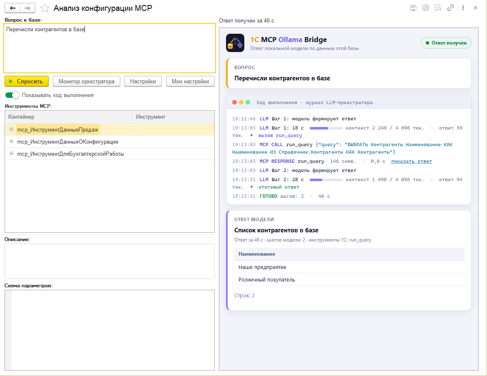
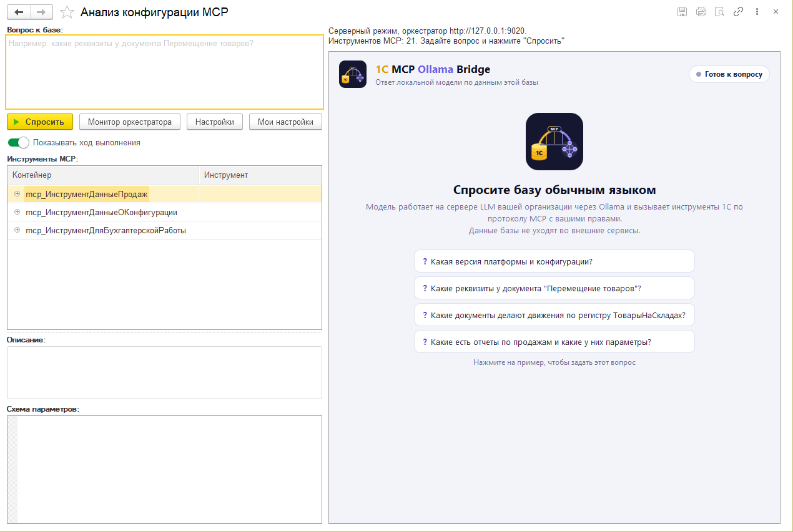
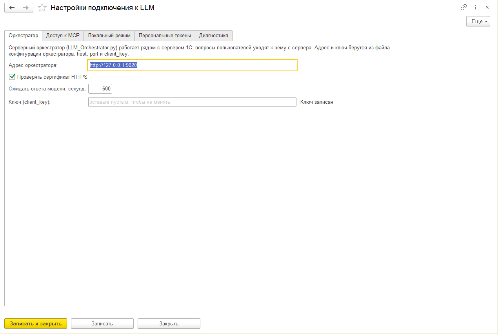
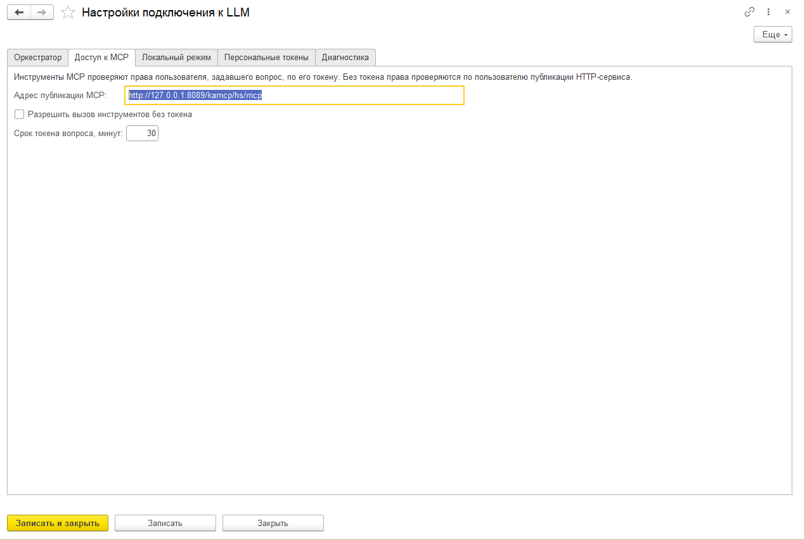
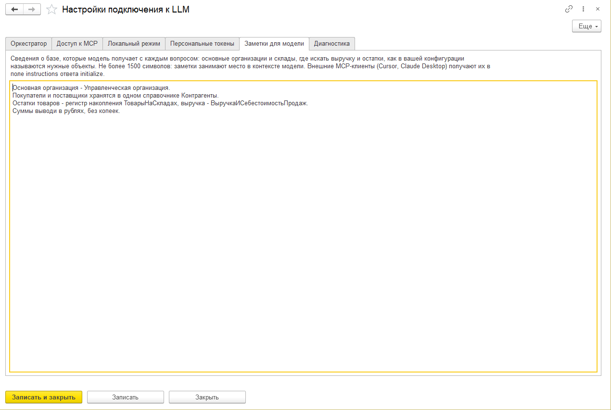
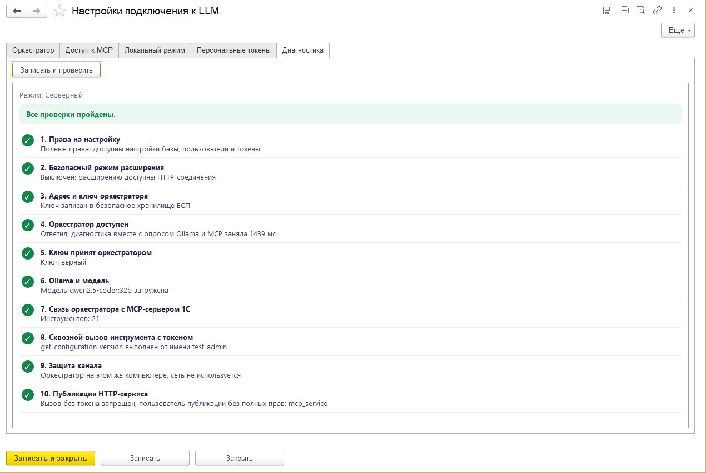
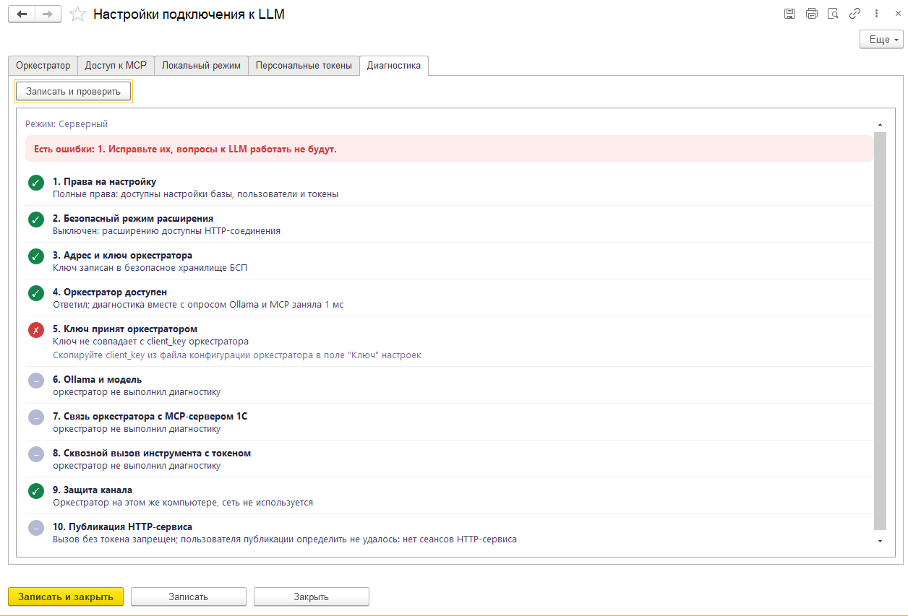
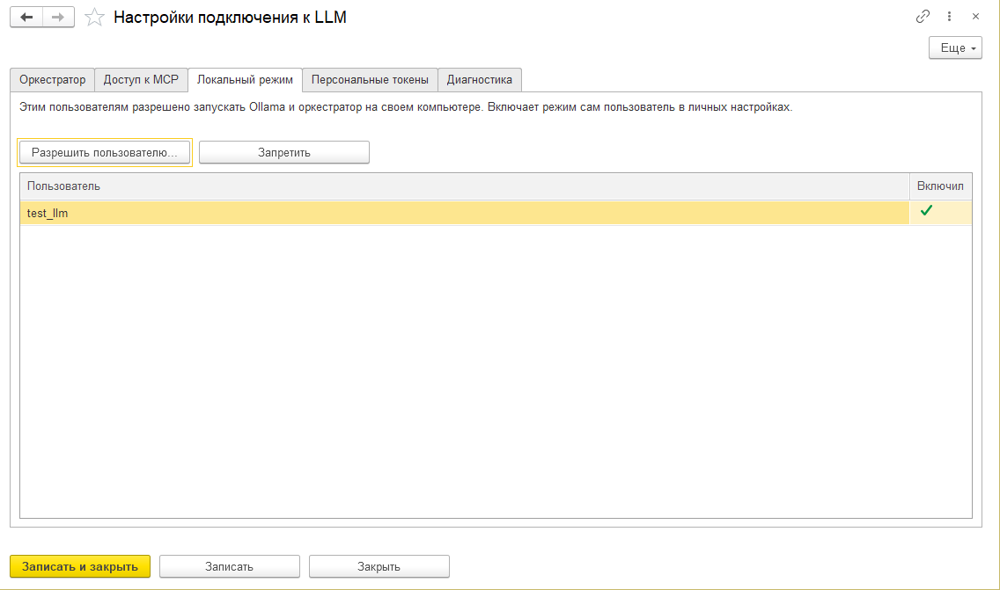
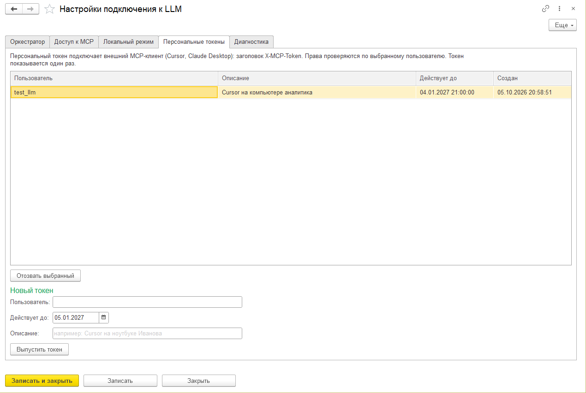

# Инструкция администратора

Порядок подключения 1C MCP Ollama Bridge к базе: от установки расширения до проверки, что пользователи
получают ответы. Технические подробности (формат файлов, API, переменные окружения) - в
[INSTALL.md](INSTALL.md), работа пользователя - в [инструкции пользователя](USER_GUIDE.md).

Снимки экрана сделаны в тестовой копии 1С:Комплексной автоматизации 2: оркестратор и Ollama с моделью
`qwen2.5-coder:32b` на том же компьютере, видеокарта RTX 5070 12 ГБ.

## Содержание

1. [Схема и требования](#1-схема-и-требования)
2. [Расширение](#2-расширение)
3. [Права пользователей](#3-права-пользователей)
4. [Публикация HTTP-сервиса](#4-публикация-http-сервиса)
5. [Сервер LLM: Ollama и оркестратор](#5-сервер-llm-ollama-и-оркестратор)
6. [Настройки подключения в 1С](#6-настройки-подключения-в-1с)
7. [Диагностика](#7-диагностика)
8. [Локальный режим](#8-локальный-режим)
9. [Персональные токены для Cursor и Claude Desktop](#9-персональные-токены-для-cursor-и-claude-desktop)
10. [Обновление расширения](#10-обновление-расширения)
11. [Неполадки](#11-неполадки)

## 1. Схема и требования

```
Пользователь 1С --вопрос--> сервер 1С --POST /requests--> оркестратор --> Ollama (модель)
                                                              |
                                  инструменты 1С <--MCP-- HTTP-сервис mcp_APIBackend
```

Пользователь задает вопрос в обработке "Анализ конфигурации MCP". Оркестратор передает вопрос модели,
модель вызывает инструменты 1С через HTTP-сервис расширения, инструменты выполняются с правами
пользователя, задавшего вопрос.

| Компонент | Требование |
|---|---|
| Конфигурация | на БСП 3.1 и новее, режим совместимости 8.3.14 и выше |
| Платформа | 8.3.14 и новее |
| Веб-сервер | Apache или IIS с модулем веб-расширения 1С, для публикации HTTP-сервиса |
| Сервер LLM | Ollama, модель `qwen2.5-coder:32b` (около 20 ГБ), видеокарта от 12 ГБ |
| Оркестратор | Python 3.10 и новее, пакет `requests` |

Режимов работы два. В серверном Ollama и оркестратор работают на сервере организации, вопросы
отправляет сервер 1С. В локальном они работают на компьютере пользователя, вопросы отправляет его
клиент 1С. Режим выбирается для каждого пользователя, по умолчанию серверный.

## 2. Расширение

1. Скачайте `MCP_Server-<версия>.cfe` со страницы
   [релизов](https://github.com/Kickfok/1c-mcp-ollama/releases).
2. "Администрирование" - "Печатные формы, отчеты и обработки" - "Расширения" - "Добавить из файла".
3. В карточке расширения снимите флажки "Безопасный режим" и "Защита от опасных действий".
   В безопасном режиме платформа запрещает расширению исходящие HTTP-запросы, и вопросы в серверном
   режиме не отправляются.
4. Перезапустите сеанс 1С.

Пакетная загрузка через Конфигуратор - [INSTALL.md, раздел 1](INSTALL.md#1-расширение).

## 3. Права пользователей

Расширение добавляет две роли:

| Роль | Кому |
|---|---|
| "Вопросы к LLM по данным базы (MCP)" (`mcp_ИспользованиеLLM`) | пользователям, которые задают вопросы |
| `mcp_ОсновнаяРоль` | техническому пользователю публикации HTTP-сервиса |

В конфигурации на БСП роли выдаются через профиль групп доступа. Роль, назначенная пользователю
напрямую, БСП удаляет при пересчете ролей, например после обновления расширения.

1. "Администрирование" - "Пользователи и права" - "Профили групп доступа" - "Создать". Наименование,
   например, "Вопросы к LLM". Роли: "Вопросы к LLM по данным базы (MCP)" и "Базовые права БСП".
2. "Группы доступа" - "Создать": профиль из шага 1, участники - пользователи, которые будут задавать
   вопросы.

Инструменты 1С проверяют права пользователя, задавшего вопрос: объекты без права чтения скрываются
из списков, запрос их структуры или данных отклоняется. Ограничения на уровне записей (RLS) не
применяются: данные читаются сеансом пользователя публикации.

### Запросы, которые пишет модель

Если готового инструмента для вопроса нет, модель составляет запрос на языке 1С и выполняет его
инструментом `run_query`. Образцы запросов она берет из схем компоновки отчетов (`find_report_queries`),
текст проверяет инструментом `validate_query`. Перед выполнением сервер проверяет право "Чтение"
пользователя на каждую таблицу запроса, включая таблицы вложенных запросов и объекты полей,
прочитанных через точку. Нет права хотя бы на одну таблицу - запрос не выполняется, модель получает
текст ошибки с именем таблицы.



Запрос выполняется с `РАЗРЕШЕННЫЕ`, результат ограничен 20 строками, модель может запросить до 500.
Ограничения на уровне записей (RLS) к `run_query` не применяются. Если в базе они настроены, не
включайте в группу доступа с ролью "Вопросы к LLM по данным базы (MCP)" пользователей, для которых они
заданы.

## 4. Публикация HTTP-сервиса

1. Создайте технического пользователя, например `mcp_service`: без полных прав, роли
   `mcp_ОсновнаяРоль` и "Базовые права БСП", в БСП отметьте его как служебного.
2. Опубликуйте базу на веб-сервере и перечислите HTTP-сервис расширения в `default.vrd` явно:
   сервисы расширений настройкой `publishByDefault` не публикуются.

```xml
<httpServices publishByDefault="true">
    <service name="mcp_APIBackend" rootUrl="mcp" enable="true"
             reuseSessions="autouse" sessionMaxAge="20" poolSize="10" poolTimeout="5"/>
</httpServices>
```

Полный пример `default.vrd` - [INSTALL.md, раздел 3](INSTALL.md#3-публикация-http-сервиса).

3. Проверьте: `http://сервер/база/hs/mcp/health` отвечает `{"status": "ok"}`.

Не публикуйте сервис под администратором: инструмент, вызванный без токена, получит все данные базы.

## 5. Сервер LLM: Ollama и оркестратор

1. Установите [Ollama](https://ollama.com) и загрузите модель:

   ```bash
   ollama pull qwen2.5-coder:32b
   ```

2. Скачайте `LLM_Orchestrator-<версия>.zip` со страницы релизов и распакуйте, установите зависимости:

   ```bash
   pip install -r requirements.txt
   ```

3. Рядом с `LLM_Orchestrator.py` создайте `LLM_Orchestrator.config.json` с адресом публикации из
   раздела 4, при необходимости добавьте `host` и `port` (все поля - [INSTALL.md, раздел 5](INSTALL.md#5-оркестратор)):

   ```json
   {
     "mcp_url": "http://сервер/база/hs/mcp",
     "port": 9000
   }
   ```
4. Запустите:

   ```bash
   python LLM_Orchestrator.py --config LLM_Orchestrator.config.json
   ```

При первом запуске оркестратор создает и записывает в файл конфигурации два ключа:

- `client_key` - ключ клиента, им 1С задает вопросы. Вписывается в настройки 1С (раздел 6).
- `admin_key` - ключ администратора, вход в монитор оркестратора.

Если оркестратор слушает сетевой адрес, а не `127.0.0.1`, задайте `tls_cert` и `tls_key`: без них ключ и
вопросы идут по сети открытым текстом. Файл конфигурации содержит ключи, доступ к нему ограничьте
пользователем, под которым работает оркестратор.

Первый вопрос после запуска медленнее остальных: модель загружается в видеопамять, на RTX 5070 около
минуты. Если Ollama сообщает `CUDA error`, задайте число слоев модели на видеокарте в `ollama_num_gpu`
(для 32B на 12 ГБ - `24`).

## 6. Настройки подключения в 1С

Откройте "MCP-сервер" - "Анализ конфигурации MCP". Пользователю с полными правами видна кнопка
"Настройки". Если подключение еще не настроено, настройки открываются сами при открытии формы.



### Оркестратор



| Поле | Что указать |
|---|---|
| Адрес оркестратора | `http://127.0.0.1:9000`, если оркестратор на сервере 1С, или `https://сервер:9000` |
| Проверять сертификат HTTPS | Снимите только для самоподписанного сертификата в тестовой среде |
| Ожидать ответа модели, секунд | Сколько форма ждет ответ модели, затем останавливает запрос. По умолчанию 1800 |
| Ключ (client_key) | `client_key` из файла конфигурации оркестратора. Ключ хранится в безопасном хранилище БСП и на форму не выводится: надпись справа показывает, записан ли он. Пустое поле при записи ключ не меняет |

### Доступ к MCP



| Поле | Что указать |
|---|---|
| Адрес публикации MCP | Адрес HTTP-сервиса из раздела 4. Нужен для локального режима: его получает оркестратор на компьютере пользователя |
| Разрешить вызов инструментов без токена | Снимите после настройки: без флажка HTTP-сервис отклоняет вызовы без токена пользователя |
| Срок токена вопроса, минут | Сколько действует токен, выданный на один вопрос. Токен отзывается раньше, когда ответ получен |

### Заметки для модели



Здесь описывают особенности базы, которые модель не узнает из метаданных: основную организацию и
склады, в каком регистре искать выручку и остатки, в каких единицах выводить суммы. Заметки уходят
оркестратору с каждым вопросом и добавляются в промпт на каждом шаге модели. Внешние MCP-клиенты
(Cursor, Claude Desktop) получают их в поле `instructions` ответа `initialize`.

Длина заметок ограничена 1500 символами: они занимают место в контексте модели (4096 токенов), и
длинные заметки оставляют меньше места для ответов инструментов.

### Запись

"Записать" или "Записать и закрыть". Затем вкладка "Диагностика" - "Записать и проверить".

## 7. Диагностика

На вкладке "Диагностика" кнопка "Записать и проверить" выполняет 10 проверок: от прав на
настройку до сквозного вызова инструмента 1С с токеном через оркестратор и модель.



| Проверка | Что проверяется |
|---|---|
| 1. Права на настройку | Полные права у пользователя, выполняющего проверку |
| 2. Безопасный режим расширения | Расширению разрешены HTTP-соединения |
| 3. Адрес и ключ оркестратора | Адрес задан, ключ записан |
| 4. Оркестратор доступен | Оркестратор отвечает по адресу |
| 5. Ключ принят оркестратором | Ключ совпадает с `client_key` |
| 6. Ollama и модель | Ollama отвечает, модель загружена |
| 7. Связь оркестратора с MCP-сервером 1С | Оркестратор получает список инструментов |
| 8. Сквозной вызов инструмента с токеном | Инструмент выполнен от имени пользователя, выполняющего проверку |
| 9. Защита канала | HTTPS либо оркестратор на этом же компьютере |
| 10. Публикация HTTP-сервиса | Вызов без токена запрещен, пользователь публикации без полных прав |

Проверка с ошибкой выделяется красным, под ней выводится, что исправить. Проверки, которые зависят от
нее, не выполняются. Пример: ключ в 1С не совпадает с `client_key` оркестратора.



После успешной проверки откройте форму под пользователем из группы доступа (раздел 3) и задайте
вопрос, например "Какая версия платформы 1С в базе?".

## 8. Локальный режим

Локальный режим разрешается пользователю, у которого на компьютере есть видеокарта для модели.

1. Вкладка "Доступ к MCP": заполните адрес публикации MCP, доступный с компьютера пользователя.
2. Вкладка "Локальный режим" - "Разрешить пользователю..." - выберите пользователя.



Колонка "Включил" показывает, включил ли пользователь режим в "Мои настройки". "Запретить" возвращает
выбранного пользователя в серверный режим.

На компьютере пользователя нужны Ollama с моделью и Python 3.10+. Остальное пользователь настраивает
сам в "Мои настройки", включая автозапуск: при первом вопросе 1С записывает оркестратор на его
компьютер и запускает. Подробно - в [инструкции пользователя](USER_GUIDE.md#локальный-режим).

## 9. Персональные токены для Cursor и Claude Desktop

Внешний MCP-клиент (Cursor, Claude Desktop) подключается к HTTP-сервису напрямую, без оркестратора.
Чтобы его вызовы выполнялись с правами конкретного пользователя, выпустите ему персональный токен.



1. Блок "Новый токен": пользователь, срок действия, описание (например, "Cursor на ноутбуке Иванова").
2. "Выпустить токен". Токен показывается один раз: скопируйте его и передайте пользователю.
3. Клиент передает токен заголовком `X-MCP-Token`.

"Отозвать выбранный" отключает токен сразу.

## 10. Обновление расширения

1. Загрузите новый `.cfe` в списке расширений командой обновления из файла, проверьте флажки
   безопасного режима в карточке расширения.
2. Если версия включает новый `LLM_Orchestrator.py`, замените его на сервере LLM и перезапустите
   оркестратор. Файл конфигурации с ключами не заменяйте.
3. Вкладка "Диагностика" - "Записать и проверить".

Роли, выданные через профиль групп доступа, после обновления сохраняются.

## 11. Неполадки

| Симптом | Причина и решение |
|---|---|
| `.../hs/mcp/health` отвечает 404 | HTTP-сервис не перечислен в `default.vrd` (раздел 4) |
| Оркестратор не получает список инструментов, хотя `/health` отвечает | Регистр имени публикации в `mcp_url` не совпадает с `base` в `default.vrd`: веб-сервер перенаправляет запрос, и POST превращается в GET |
| Проверка 2: безопасный режим | В карточке расширения снимите "Безопасный режим" |
| Проверка 5: ключ не принят | Скопируйте `client_key` из файла конфигурации оркестратора в поле "Ключ" |
| Проверка 6: модель не найдена | `ollama pull qwen2.5-coder:32b` на сервере LLM |
| Проверка 7: нет связи с MCP | Оркестратор не достает до `mcp_url`: проверьте адрес и доступ с сервера LLM |
| Проверка 10: вызов без токена разрешен | Снимите "Разрешить вызов инструментов без токена" |
| Проверка 10: пользователь публикации с полными правами | Опубликуйте сервис под техническим пользователем (раздел 4) |
| У пользователя нет раздела "MCP-сервер" | Пользователь не входит в группу доступа с ролью "Вопросы к LLM по данным базы (MCP)" |
| Модель отвечает "нет доступа к объекту" | У пользователя нет права чтения объекта в 1С: так работает проверка прав |
| `run_query` отвечает "У пользователя нет прав на ...: запрос к этим данным не выполняется" | Запрос модели читает таблицу, на которую у пользователя нет права. Выдайте право через профиль групп доступа или задайте вопрос иначе |
| Модель долго пересказывает структуру объекта вместо данных | Модель не стала писать запрос. Уточните вопрос: "выполни запрос и покажи...", или опишите в заметках, где лежат нужные данные |
| Ответ дольше таймаута | Увеличьте "Ожидать ответа модели" или проверьте, что модель помещается в видеопамять |

Журнал оркестратора с вопросами всех пользователей, шагами модели и вызовами инструментов -
"Монитор оркестратора", вход по `admin_key`.
