# Инструкция пользователя

Обработка "Анализ конфигурации MCP" отвечает на вопросы о базе 1С, заданные обычным языком. Ответ
формирует языковая модель в Ollama: она вызывает инструменты 1С (структура объектов, версия
конфигурации, отчеты, запросы к данным) и по их результатам пишет ответ. Модель работает на сервере вашей
организации или на вашем компьютере, данные базы во внешние сервисы не передаются.

Инструменты 1С выполняются с вашими правами: объекты, на которые у вас нет права чтения, модель не
видит. Подключение к модели настраивает администратор, см. [инструкцию администратора](ADMIN_GUIDE.md).

Снимки экрана сделаны в тестовой копии 1С:Комплексной автоматизации 2 с моделью `qwen2.5-coder:32b`
на видеокарте RTX 5070 12 ГБ.

## Содержание

- [Где найти](#где-найти)
- [Окно обработки](#окно-обработки)
- [Как задать вопрос](#как-задать-вопрос)
- [Вопросы о данных базы](#вопросы-о-данных-базы)
- [Ход выполнения и ответ](#ход-выполнения-и-ответ)
- [Остановка запроса](#остановка-запроса)
- [Права на данные](#права-на-данные)
- [Локальный режим](#локальный-режим)
- [Если вопрос не задается](#если-вопрос-не-задается)

## Где найти

Раздел "MCP-сервер", команда "Анализ конфигурации MCP". Раздел и команда видны пользователю,
которому администратор выдал роль "Вопросы к LLM по данным базы (MCP)". Нет раздела - обратитесь к
администратору.

## Окно обработки

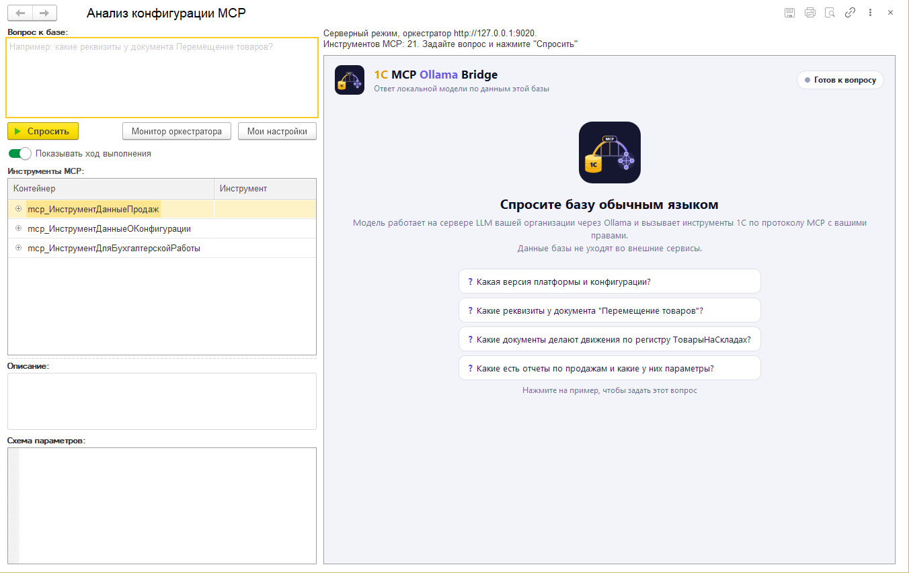

| Элемент | Назначение |
|---|---|
| Вопрос к базе | Текст вопроса |
| Спросить | Отправить вопрос, то же самое - `Ctrl+Enter` в поле вопроса |
| Остановить | Видна вместо "Спросить", пока модель отвечает |
| Монитор оркестратора | Журнал работы оркестратора в браузере. В серверном режиме вход по ключу администратора, в локальном - по вашему ключу из "Мои настройки" |
| Мои настройки | Локальный режим и проверка подключения, см. [Локальный режим](#локальный-режим) |
| Показывать ход выполнения | Показывать в ответе шаги модели и вызовы инструментов |
| Инструменты MCP | Инструменты, доступные модели. Для выбранного инструмента ниже выводятся описание и схема параметров |

Строка над ответом показывает режим работы и состояние: "Серверный режим, оркестратор ..." или
"Локальный режим, оркестратор на этом компьютере", число инструментов, время работы модели.

## Как задать вопрос

1. Введите вопрос в поле "Вопрос к базе".
2. Нажмите "Спросить" или `Ctrl+Enter`.

На стартовом экране справа есть примеры вопросов: нажатие на пример сразу отправляет его.

Модель отвечает лучше, когда вопрос называет объект и то, что о нем нужно узнать:

| Вопрос | Какой инструмент вызовет модель |
|---|---|
| Какая версия платформы 1С в базе? | `get_configuration_version` |
| Какие реквизиты у документа "Перемещение товаров"? | `get_metadata_structure` |
| Какие документы делают движения по регистру ТоварыНаСкладах? | `list_object_dependencies` |
| Какие есть отчеты по продажам и какие у них параметры? | `get_report_list` |
| Перечисли контрагентов в базе | `run_query` |

Полный список инструментов - [TOOLS.md](TOOLS.md).

## Вопросы о данных базы

Для вопросов о данных (списки, количество, суммы) отдельного инструмента обычно нет. Тогда модель сама
составляет запрос на языке 1С: узнает имена полей, при необходимости находит похожий запрос в отчетах
конфигурации, проверяет текст и выполняет его. Результат выводится таблицей, под ней число строк.

Запрос выполняется только по таблицам, на которые у вас есть право чтения. По умолчанию модель
получает не больше 20 строк; если строк больше, под таблицей написано, что показаны не все.

Модель выбирает запрос не всегда. Если вместо данных она пересказывает структуру справочника или
документа, задайте вопрос прямее: "выполни запрос и покажи список ...".

## Ход выполнения и ответ

Пока модель работает, справа выводится журнал: шаги модели, вызовы инструментов 1С с параметрами и
время каждого шага.

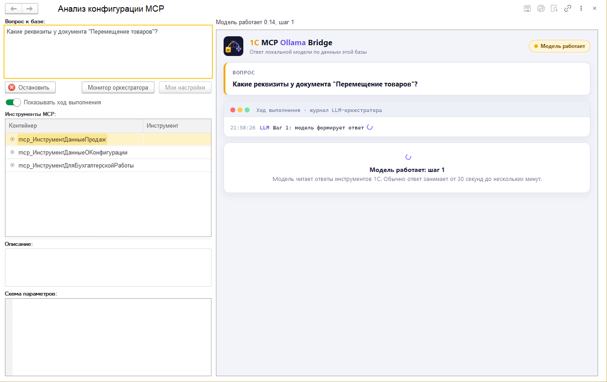

Когда ответ получен, под журналом выводится блок "Ответ модели": заголовок, время, число шагов,
использованные инструменты и данные. Ссылка "показать ответ" в журнале раскрывает ответ инструмента
1С целиком.

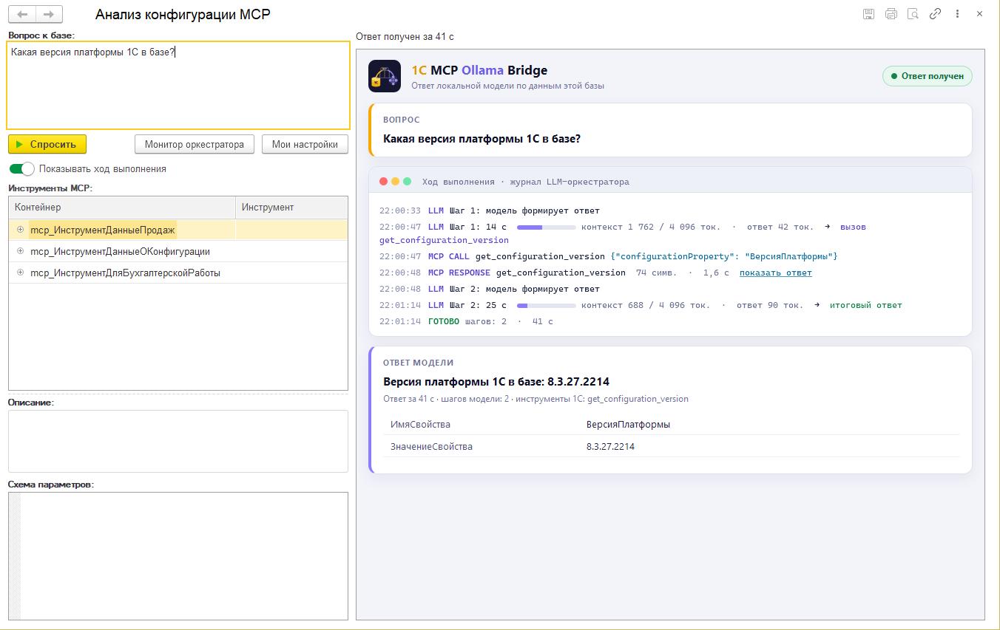

Время ответа зависит от видеокарты и размера модели. На снимке простой вопрос с одним вызовом
инструмента занял около минуты. Первый вопрос после запуска Ollama медленнее: модель загружается в
видеопамять.

## Остановка запроса

Нажмите "Остановить". Оркестратор прекращает работу после текущего шага модели, в ответе выводится
"Запрос остановлен". Запрос останавливается и при закрытии формы.

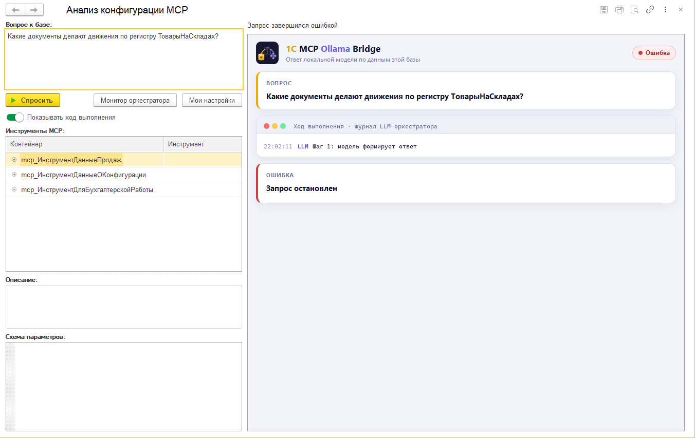

## Права на данные

Каждый вопрос отправляется с токеном текущего пользователя. Инструменты 1С проверяют права по этому
токену: объект, на который у вас нет права чтения, модели недоступен, и она сообщает об этом в ответе.

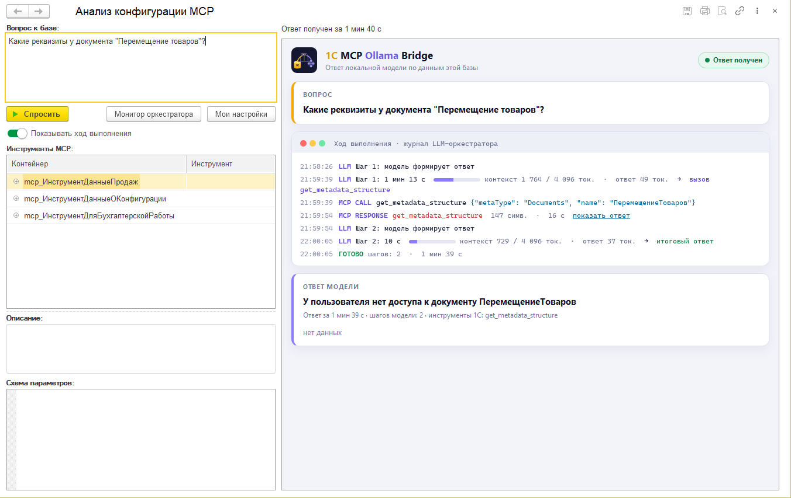

Если вам нужны такие данные, обратитесь к администратору за правами в 1С. Токен действует только на
время вопроса и отзывается, когда ответ получен или запрос остановлен.

## Локальный режим

В локальном режиме Ollama и оркестратор работают на вашем компьютере, вопросы к ним отправляет ваш
клиент 1С. Режим нужен, когда на компьютере есть видеокарта для модели, а сервера LLM в организации
нет. Работает только в тонком клиенте.

Нужны:

- разрешение администратора (без него флажок локального режима недоступен);
- [Ollama](https://ollama.com) с моделью `qwen2.5-coder:32b` (`ollama pull qwen2.5-coder:32b`);
- Python 3.10 или новее.

### Настройка

Откройте "Мои настройки":

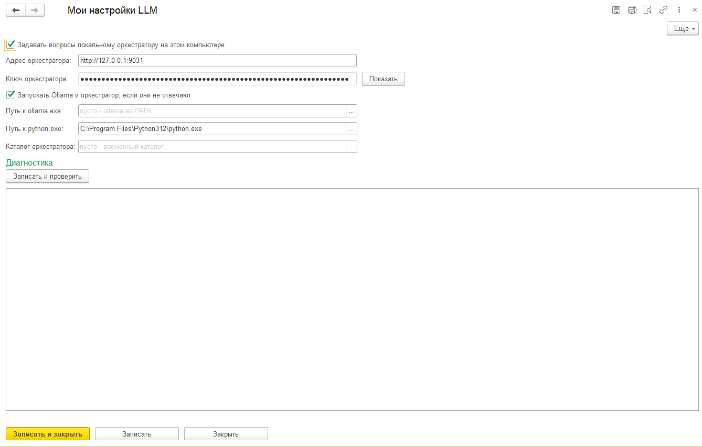

| Поле | Что указать |
|---|---|
| Задавать вопросы локальному оркестратору на этом компьютере | Включить локальный режим |
| Адрес оркестратора | `http://127.0.0.1:9000` или другой свободный порт. Допускаются только `127.0.0.1` и `localhost` |
| Ключ оркестратора | Создается автоматически. "Показать" нужна, только если оркестратор запускается вручную: ключ вписывается в его файл конфигурации как `client_key` и `admin_key` |
| Запускать Ollama и оркестратор, если они не отвечают | Автозапуск при вопросе |
| Путь к ollama.exe | Пусто - команда `ollama` из PATH. Кнопка "..." открывает выбор файла |
| Путь к python.exe | Полный путь к python.exe. Кнопка "..." открывает выбор файла |
| Каталог оркестратора | Куда записывается оркестратор. Пусто - временный каталог. Кнопка "..." открывает выбор каталога |

Укажите путь к python.exe полностью, например
`C:\Users\<имя>\AppData\Local\Programs\Python\Python312\python.exe`: команда `python` в Windows может
вести к заглушке Microsoft Store.

Кнопка "Записать и проверить" записывает настройки и выполняет проверку подключения с этого
компьютера.

После включения строка над ответом показывает "Локальный режим, оркестратор на этом компьютере":

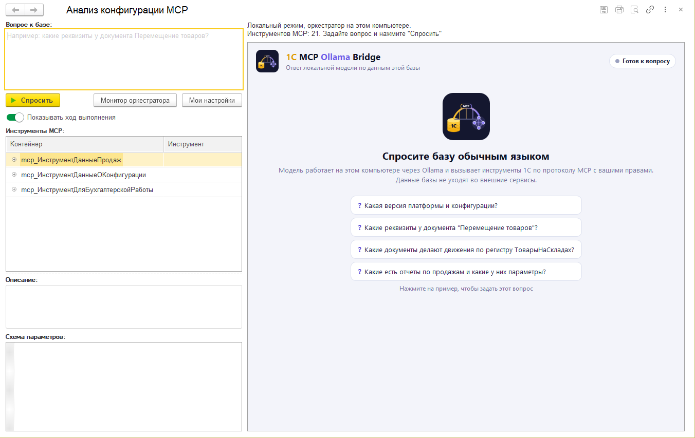

### Первый вопрос: автозапуск

Если оркестратор не отвечает и включен автозапуск, форма спрашивает, запустить ли его:

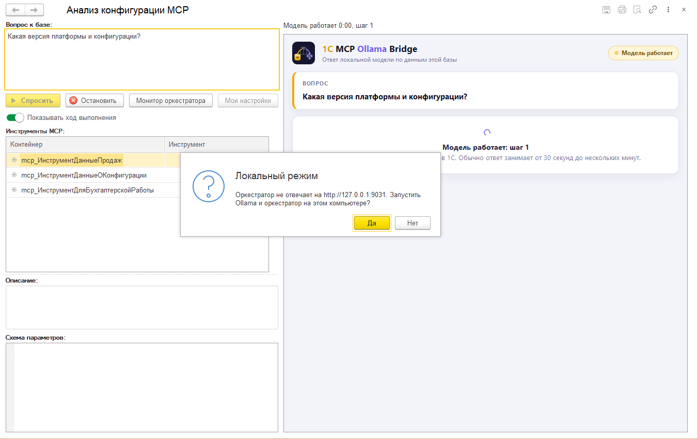

После ответа "Да" 1С записывает оркестратор в каталог из настроек, запускает Ollama (если она не
запущена) и оркестратор в отдельном окне. Через 10-30 секунд вопрос уходит модели. Окно оркестратора не
закрывайте: следующие вопросы пойдут к нему без запуска.

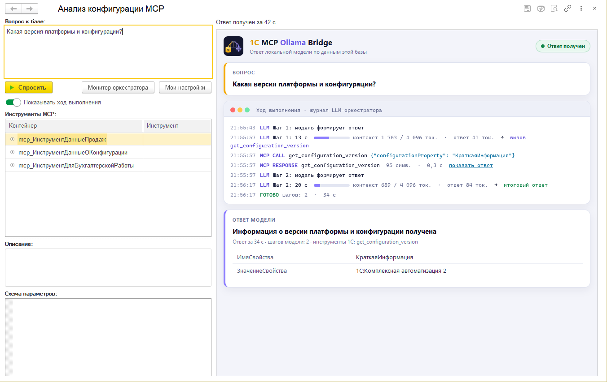

Если у Python нет пакета `requests`, форма предлагает установить его командой
`python -m pip install --user requests`. Ответ "Да" устанавливает пакет и продолжает запуск.

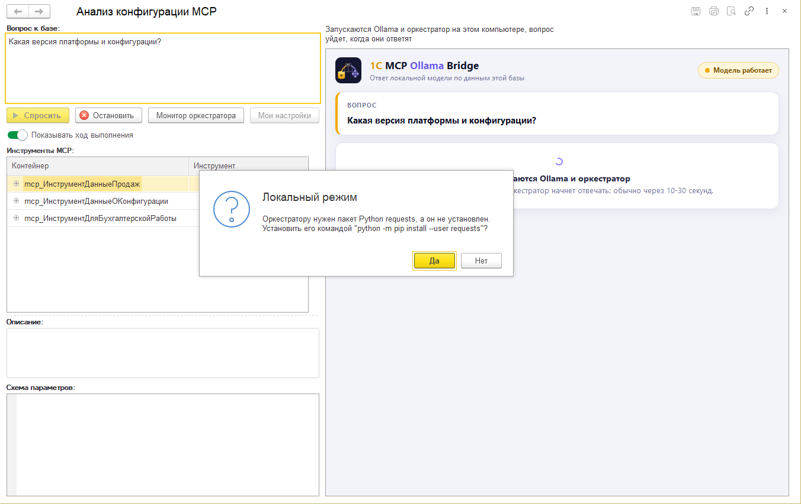

## Если вопрос не задается

Подключение не настроено: стартовый экран показывает причину, кнопка "Спросить" недоступна.
Подключение настраивает администратор.

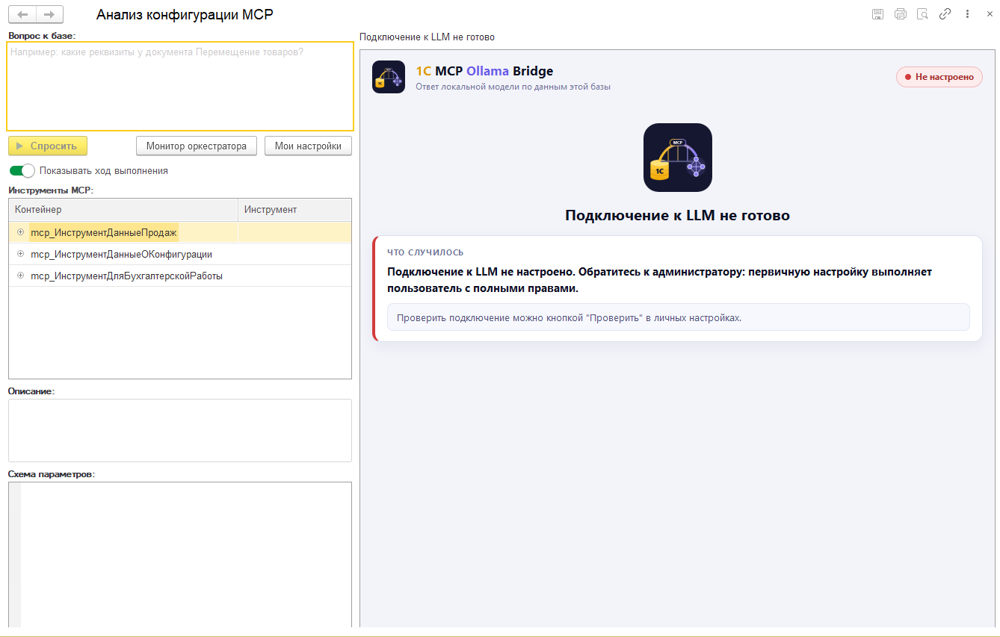

Python не запустился: путь к python.exe в "Мои настройки" неверный или Python не установлен.
Укажите полный путь кнопкой "...".

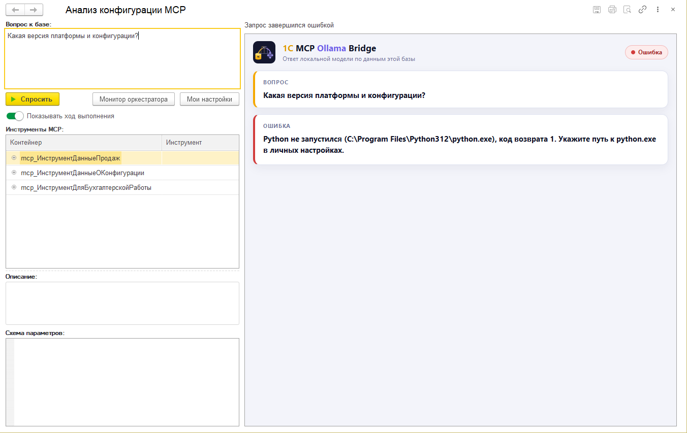

| Сообщение | Что сделать |
|---|---|
| Оркестратор не отвечает | Серверный режим: сообщите администратору. Локальный: включите автозапуск или запустите оркестратор вручную |
| Локальный режим недоступен в веб-клиенте | Откройте базу в тонком клиенте |
| Модель не уложилась в таймаут | Упростите вопрос или попросите администратора увеличить "Ожидать ответа модели" |
| pip не установил пакет requests | Выполните в командной строке `<путь к python.exe> -m pip install requests` |
| Оркестратор не ответил за две минуты | Причина видна в окне оркестратора: не найдена модель Ollama, недоступна публикация MCP или занят порт |

Если ошибка повторяется, нажмите "Записать и проверить" в "Мои настройки" и передайте результат
проверки администратору.
